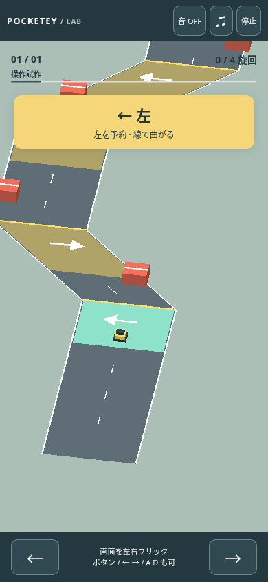

# Alpine Drive — input prototype

Draft only. Review route: `/prototypes/alpine-drive/?lang=ja` (also `lang=en`).
The route is unlisted, `noindex,nofollow`, and excluded from the sitemap by the
existing prototype filter. No homepage or existing game page is changed.

This delivery intentionally covers input and one playable greybox course.
**The visual art pass, mountain scenery and B-reference matching have not started.**
All visible models are local Three.js primitives; no purchased assets are used.



## Controls and rules

- The car advances automatically at 4 metres/second along z. One 50-metre stage
  takes about 12.5 seconds of simulation time to clear.
- Enter a yellow road zone, then flick horizontally in the arrow's direction.
  A flick needs at least 28 CSS pixels within 600 ms; taps and vertical gestures
  do not turn. Left/right buttons and Arrow keys / A / D provide the same command.
- The five-metre input zone lasts 1.25 simulation seconds. The last valid flick
  replaces the queued direction; the car turns exactly 45° at the yellow line.
  Headings are limited to left diagonal, straight and right diagonal. No free
  steering or automatic correction is applied between gates.
- Four required commands: left, right, right, left. Red blocks sit on missed-turn
  paths. Correct commands, including at both ends of the allowed window, clear.
- The square dark bumper is the collision footprint (0.96 × 0.96 metres).
  Red boxes use axis-aligned rectangular collision; contact with the road edge
  also fails. Collision is checked before the goal. There is no physics engine.
- Pause with the top button or Esc / P. Blur, hidden tabs and audio settings
  pause and clear queued input. Resume explicitly, then enter a turn again if
  still in the yellow zone. Retry creates a fresh state immediately.
- Camera position follows the car with a fixed oblique angle and orthographic
  projection; it never turns with the car.

## Existing integration

The existing locale module, language switch, audio dialog, independent music/SFX
sliders, mute, effects and TiltTrail score are reused. The shared audio modules
only gain an `alpine` registration; the four existing entries are unchanged.
Audio settings use the separate `alpine` member of `pocketey-audio-v1`.
Clears and mute preference use `pocketey-alpine-prototype-v1`. Other game records
are never migrated or reset. Storage failures leave the game playable in-tab.

## Validation, 2026-10-08

| Layer | Result | Meaning |
| --- | --- | --- |
| Pure game/input rules | 12 / 12 pass | Clear at early/late window boundaries, wrong/missed turns, footprint contact, all-course clearance, frame subdivision, frozen phases, flick rejection and malformed saves |
| Browser input, isolated from rendering | 6 / 6 pass | Real CDP touch flicks and keyboard clears; failure/retry; cancel/pause/audio isolation; language and storage; narrow layout; context loss |
| Existing + new model suite | 36 / 36 pass | `npm test`, including the existing games' model tests |
| Types and build | Pass | `npm run check:games`, `npm run check` (0 errors, 8 pre-existing hints), `npm run build` and portal route guards |
| Real WebGL smoke | Pass | Chromium 151, SwiftShader, 390 × 844. Real touch input queues left and the car turns; 3 screenshots reviewed, no page errors |
| Frame rate / input latency | **Not measured** | The screenshot run uses a controlled clock; this is not performance acceptance |

The input suite intercepts **only** the dev-server renderer module with a no-op
view. It runs the real HTML, app, input listeners, simulation, UI and storage,
using Playwright's controlled clock. Production has no test route flags, hidden
state setters or alternate game loop. The separate render smoke uses the built
page and actual Three.js without interception.

At the queued screenshot the real renderer reported 61 draws / 298 triangles;
after the first turn, 62 draws / 300 triangles. These counts describe the greybox
scene, not a claim about a completed art pass or target-device performance.

The initial render command could not connect because the preview process failed
to start (Astro's telemetry config directory was not writable). The startup error
is retained in `evidence/initial-startup-failure.json`. After starting preview
with telemetry disabled, one actual WebGL run passed. No failed SwiftShader
performance run was repeated until success. TLS verification stayed enabled.

Screenshots: [ready](evidence/01-ready.png), [queued](evidence/02-turn-queued.png),
[after turn](evidence/03-after-turn.png). Machine results:
[render](evidence/render-smoke.json), [input](evidence/input-report.json),
[model output](evidence/model-tests.txt).

Representative screenshot saved to Library:
`libfile_8021f3e6d3d081918d69665f0df6b279` (`02-turn-queued.png`).

## Reference-image blocker

The required Library item `libfile_657739ffe39c81918f2b7d27787b3563`
(`B-alpine-road.png`) could not be read locally. Library preparation succeeded;
the returned image download on host `sdmntprcentralus.oaiusercontent.com`
returned HTTP 403, including the one authorized retry to an explicit local
destination. Existing logs contain no more specific cause. This does not prove
an allowlist or authorization diagnosis. No further retrieval or alternate
copying route was attempted. No signed URLs or tokens are recorded here.

The parent explicitly narrowed this delivery to the independent gameplay
prototype. A later user reattachment (`libfile_750684ec7fe08191b8f0a43043768760`)
was tried once through the same official procedure. Preparation succeeded, but
the download host `sdmntprsouthcentralus.oaiusercontent.com` returned only the
helper error `download failed`, with no HTTP status or more specific cause.
The local image was absent. There was no further attempt. Apply the image's art
direction to this same course only after its actual pixels become available in
this environment.

## Remaining checks and reproduction

Unverified: real iOS/Android devices, Safari/Firefox, native hardware frame rate,
end-to-end latency under load, subjective human difficulty, and final audio
listening/mix. B-reference fidelity and mountain art are unstarted. The fixed
step loop bounds delayed-frame catch-up at 100 ms, so very slow renderers can
slow simulation; no cloud SwiftShader FPS claim is made.

```sh
npm ci
npm run check:games
ASTRO_TELEMETRY_DISABLED=1 npm run check
npm test
npm run test:alpine:input
ASTRO_TELEMETRY_DISABLED=1 npm run build
ASTRO_TELEMETRY_DISABLED=1 npm run preview -- --host 127.0.0.1 --port 4341
# In a second terminal:
npm run test:alpine:render
```

No deploy or merge is part of this prototype delivery. The existing CI branch
allowlist does not include this new branch; local checks are recorded above.
