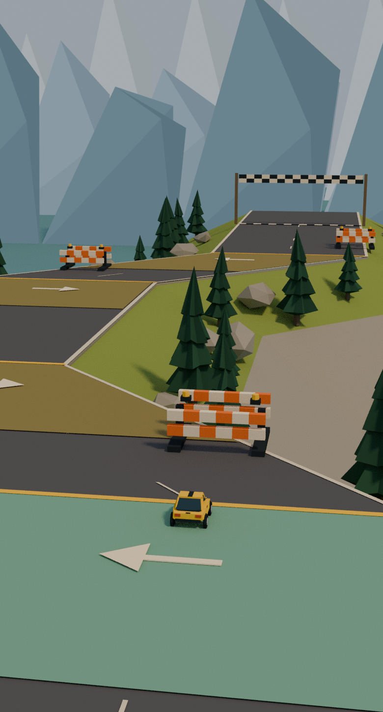

# Alpine Drive — input prototype

Draft only. Review route: `/prototypes/alpine-drive/?lang=ja` (also `lang=en`).
The route is unlisted, `noindex,nofollow`, and excluded from the sitemap by the
existing prototype filter. No homepage or existing game page is changed.

This is one stage with an original mountain scene built from the parent's
**written production brief**, not from retrieved reference-image pixels.
The new art is implemented, but its real WebGL/browser acceptance is **blocked**
in this execution environment. Do not treat the auxiliary previews as game
screenshots or as approval of reference fidelity.



## Current art pass, 2026-10-08

- Yellow rally hatchback: tapered body and hood, slanted cabin, dark glazing,
  four tires and wheel arches, rear lights, and a dark central stripe.
- Model bounds fit inside the unchanged 0.96 m square collision footprint at
  all three headings. Barrier bounds exactly match the existing obstacle X/Z
  rectangles. The road's top coordinates, course and controls are unchanged.
- Dark asphalt, warm stone edges and a faceted rock foundation; orange/ivory
  barriers with black feet and amber lamps; timber finish posts and checkers.
- Three shared fir meshes and three shared rock meshes, instanced off the road.
  Three blue mountain layers and a lake; warm directional light and cool ambient
  light. A subtle contact patch sits under the car. No paid assets or textures.
- Camera direction remains fixed independently of steering. Perspective replaces
  the greybox's orthographic lens to show the bounded car near 71% of the portrait
  viewport while retaining the approaching turns.
- The turn cue is narrower. The 440 px minimum page height was removed, the
  compact layout retains the top safe area, and overflow panels align safely.
  Pause, volume, localization and save logic are unchanged; only the art label
  changed in `app.ts`. The header remains one stage (`01 / 01`).

Current checks:

| Layer | Current result | Limit |
| --- | --- | --- |
| Existing Alpine logic | 12/12 pass | Same model and input files as `459fcb3f229f0dee42698d91187f027b19c588a7` |
| Geometry, clearance and framing | 4/4 pass | Car footprint, barrier rectangles, scenery clearance, triangle budget, imminent turn visibility |
| Type check and production build | Pass | `check:games`, build and route guard |
| Whole-scene static budget | 8,362 triangles / 46 mesh batches | Includes every instance; not measured GPU draw calls or FPS |
| Auxiliary renders | Start, before first turn, near finish inspected | Blender Cycles CPU, same exported meshes/camera, different lighting, tone mapping and fog; no HTML UI |
| Current browser input / real WebGL | **Blocked, not rerun** | Chromium SUID sandbox helper is owned by `nobody:nogroup`; a nested user namespace cannot write `uid_map`. No permissions or sandbox settings were changed |

The first auxiliary render failed because this Blender build lacks
OpenImageDenoise. The failure log is retained. Denoising was disabled for the
CPU previews. One art composition revision lowered the camera angle so the
mountains and lake are visible; this was not a performance acceptance loop.

Representative auxiliary preview in Library: `libfile_0fb7da0bb4e08191b713c8403932295a`.

Evidence: [scene audit](evidence/art-pass/scene-audit.json),
[16 checks](evidence/art-pass/model-scene-tests.txt),
[types/build](evidence/art-pass/types-build.log),
[start](evidence/art-pass/01-start-blender-preview.png),
[before turn](evidence/art-pass/02-before-turn-blender-preview.png),
[near finish](evidence/art-pass/03-near-finish-blender-preview.png),
[initial Blender failure](evidence/art-pass/blender-initial-failure.log).

The completion requirement of three **actual game renders** remains open.
The previous 6 browser tests and limited WebGL smoke below apply only to the
saved greybox baseline, not the new art, revised camera or current mobile CSS.
No current browser, device, GPU-performance or input-latency acceptance is claimed.

Auxiliary reproduction (not a browser substitute):

```sh
node --import tsx --test tests/prototypes/alpine/model.test.ts tests/prototypes/alpine/scene.test.ts
node --import tsx tests/prototypes/alpine/export-scene.mjs
blender -b -t 4 --python tests/prototypes/alpine/render-preview.py
```

## Controls and rules

- The car advances automatically at 4 metres/second along z. One 50-metre stage
  takes about 12.5 seconds of simulation time to clear.
- Enter a yellow road zone, then flick horizontally in the arrow's direction.
  A flick needs at least 28 CSS pixels within 600 ms; taps and vertical gestures
  do not turn. Left/right buttons and Arrow keys / A / D provide the same command.
- The five-metre input zone lasts 1.25 simulation seconds. The last valid flick
  replaces the queued direction; the car turns exactly 45° at the yellow line.
  Headings are limited to left diagonal, straight and right diagonal. No free
  steering or automatic correction is applied between gates.
- Four required commands: left, right, right, left. Red blocks sit on missed-turn
  paths. Correct commands, including at both ends of the allowed window, clear.
- The fixed square collision footprint is 0.96 × 0.96 metres. The car model
  fits within it at every allowed heading.
  The orange/ivory barriers retain axis-aligned rectangular collision; contact with the road edge
  also fails. Collision is checked before the goal. There is no physics engine.
- Pause with the top button or Esc / P. Blur, hidden tabs and audio settings
  pause and clear queued input. Resume explicitly, then enter a turn again if
  still in the yellow zone. Retry creates a fresh state immediately.
- Camera position follows the car with a fixed oblique direction and perspective
  projection; it never turns with the car.

## Existing integration

The existing locale module, language switch, audio dialog, independent music/SFX
sliders, mute, effects and TiltTrail score are reused. The shared audio modules
only gain an `alpine` registration; the four existing entries are unchanged.
Audio settings use the separate `alpine` member of `pocketey-audio-v1`.
Clears and mute preference use `pocketey-alpine-prototype-v1`. Other game records
are never migrated or reset. Storage failures leave the game playable in-tab.

## Saved greybox baseline validation, 2026-10-08

| Layer | Result | Meaning |
| --- | --- | --- |
| Pure game/input rules | 12 / 12 pass | Clear at early/late window boundaries, wrong/missed turns, footprint contact, all-course clearance, frame subdivision, frozen phases, flick rejection and malformed saves |
| Browser input, isolated from rendering | 6 / 6 pass | Real CDP touch flicks and keyboard clears; failure/retry; cancel/pause/audio isolation; language and storage; narrow layout; context loss |
| Existing + new model suite | 36 / 36 pass | `npm test`, including the existing games' model tests |
| Types and build | Pass | `npm run check:games`, `npm run check` (0 errors, 8 pre-existing hints), `npm run build` and portal route guards |
| Real WebGL smoke | Pass | Chromium 151, SwiftShader, 390 × 844. Real touch input queues left and the car turns; 3 screenshots reviewed, no page errors |
| Frame rate / input latency | **Not measured** | The screenshot run uses a controlled clock; this is not performance acceptance |

The input suite intercepts **only** the dev-server renderer module with a no-op
view. It runs the real HTML, app, input listeners, simulation, UI and storage,
using Playwright's controlled clock. Production has no test route flags, hidden
state setters or alternate game loop. The separate render smoke uses the built
page and actual Three.js without interception.

At the queued screenshot the real renderer reported 61 draws / 298 triangles;
after the first turn, 62 draws / 300 triangles. These counts describe the greybox
scene, not a claim about a completed art pass or target-device performance.

The initial render command could not connect because the preview process failed
to start (Astro's telemetry config directory was not writable). The startup error
is retained in `evidence/initial-startup-failure.json`. After starting preview
with telemetry disabled, one actual WebGL run passed. No failed SwiftShader
performance run was repeated until success. TLS verification stayed enabled.

Screenshots: [ready](evidence/01-ready.png), [queued](evidence/02-turn-queued.png),
[after turn](evidence/03-after-turn.png). Machine results:
[render](evidence/render-smoke.json), [input](evidence/input-report.json),
[model output](evidence/model-tests.txt).

Representative screenshot saved to Library:
`libfile_8021f3e6d3d081918d69665f0df6b279` (`02-turn-queued.png`).

## Reference-image blocker

The required Library item `libfile_657739ffe39c81918f2b7d27787b3563`
(`B-alpine-road.png`) could not be read locally. Library preparation succeeded;
the returned image download on host `sdmntprcentralus.oaiusercontent.com`
returned HTTP 403, including the one authorized retry to an explicit local
destination. Existing logs contain no more specific cause. This does not prove
an allowlist or authorization diagnosis. No further retrieval or alternate
copying route was attempted. No signed URLs or tokens are recorded here.

The parent explicitly narrowed this delivery to the independent gameplay
prototype. A later user reattachment (`libfile_750684ec7fe08191b8f0a43043768760`)
was tried once through the same official procedure. Preparation succeeded, but
the download host `sdmntprsouthcentralus.oaiusercontent.com` returned only the
helper error `download failed`, with no HTTP status or more specific cause.
The local image was absent. During recovery the parent authorized one attempt
after adding the exact host and one after adding a wildcard domain. Both used
the official Library procedure: preparation succeeded, but the download from
`sdmntprsouthcentralus.oaiusercontent.com` failed with `download failed`, no HTTP
status. Setting propagation could not be confirmed. No pixels were obtained.
The parent then explicitly changed the input to a written production brief.
This art pass follows that text only, with no new image request, alternate copy
or claim to have viewed the reference. No TLS or domain setting was changed.

## Remaining checks and reproduction

Unverified: real iOS/Android devices, Safari/Firefox, native hardware frame rate,
end-to-end latency under load, subjective human difficulty, and final audio
listening/mix. Reference-image fidelity is not claimed; browser validation of the new mountain art is blocked. The fixed
step loop bounds delayed-frame catch-up at 100 ms, so very slow renderers can
slow simulation; no cloud SwiftShader FPS claim is made.

```sh
npm ci
npm run check:games
ASTRO_TELEMETRY_DISABLED=1 npm run check
npm test
npm run test:alpine:input
ASTRO_TELEMETRY_DISABLED=1 npm run build
ASTRO_TELEMETRY_DISABLED=1 npm run preview -- --host 127.0.0.1 --port 4341
# In a second terminal:
npm run test:alpine:render
```

No deploy or merge is part of this prototype delivery. The existing CI branch
allowlist does not include this new branch; local checks are recorded above.
