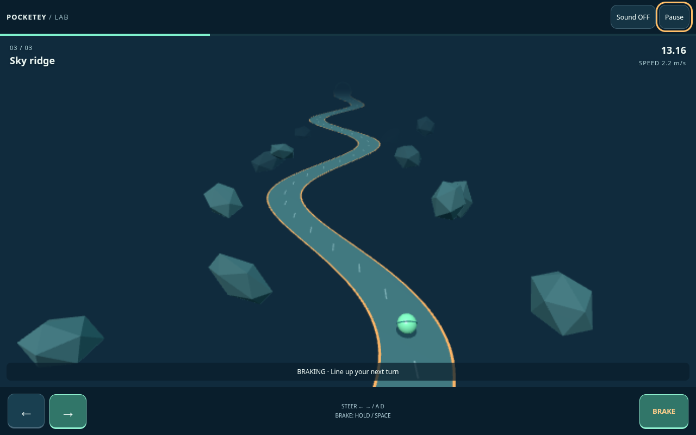
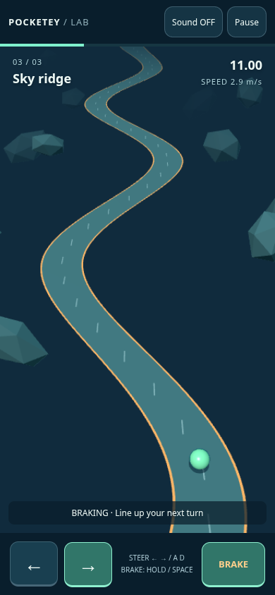
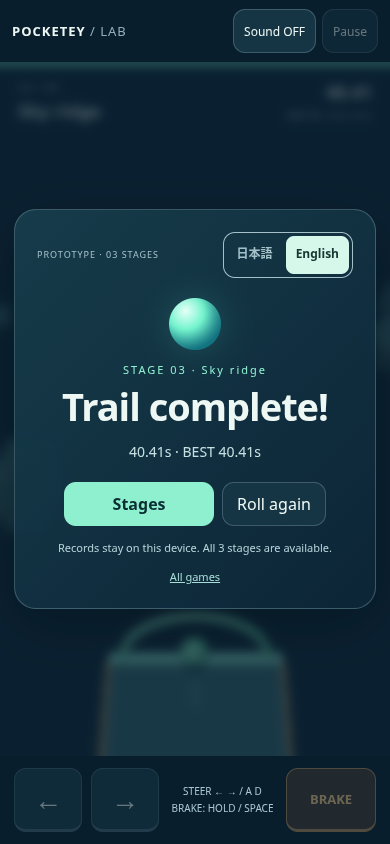

# TiltTrail validation

Final source checks and browser run passed. Tested code hashes, dates, all six stage/mode clears and compact results are in [summary.json](evidence/summary.json). Saved logs normalize terminal color escapes and trailing whitespace only.

## Passed

| Check | Result | Evidence |
| --- | --- | --- |
| New model unit tests | 6 passed; support boundary, inertia, brake, fall, finish, freeze, save and feasibility | [Model log](evidence/model-tests.txt) |
| Existing game model unit tests | 7 passed | Run with unchanged npm test |
| Game TypeScript | Passed | [Types log](evidence/game-types.txt) |
| Whole-project Astro check | 0 errors / 0 warnings / 5 existing hints | [Check log](evidence/astro-check.txt) |
| Static production build | Passed; portal retirement guard passed | [Build log](evidence/build.txt) |
| Isolated Chromium browser suite | 5 passed / 0 failed / 0 skipped / 0 flaky | [Browser log](evidence/browser-tests.txt) |
| Normal keyboard clears | Stages 1, 2 and 3; all end in clear | keyboard-stage1/2/3.json |
| Normal multi-touch clears | Stages 1, 2 and 3; steering plus brake contacts | touch-stage1/2/3.json |
| UI and lifecycle | Fail → retry; repeated tap/double click; pause/resume; key release; simultaneous touch; touch cancel; live orientation; simulated bfcache return; WebGL context loss | Browser suite |
| Locale, storage and audio | JA/EN; explicit language; independent bests persist; existing save sentinel untouched; unavailable storage message; audio context remains off before sound gesture and runs after enabling sound | Browser suite |
| Small and landscape layouts | 320×720 / 844×390, JA/EN; no horizontal overflow; all three touch controls in viewport | menu/play-ja/en-320/844.png |
| WebGL creation failure | Readable fallback with reload; no playable start action | Browser suite |

## Performance

Local headless Chromium 151.0.7922.173 built on Debian GNU/Linux 13 (trixie) on Node v24.19.0, using ANGLE SwiftShader software rendering. These are observations from active stage-3 gameplay, not estimates for a phone GPU. Both modes pass the unchanged local goals of ≥45fps, p95 ≤40ms, ≤16 draw calls and <6,000 triangles.

| Viewport | Internal framebuffer | FPS | p95 interval | Draw calls | Triangles |
| --- | --- | --- | --- | --- | --- |
| Desktop 1280×800 | 687×349 | 48.12 | 33.40ms | 10 | 5188 |
| Touch 390×844 | 367×653 | 55.74 | 16.80ms | 8 | 4536 |

Full intervals are in desktop-performance.json and mobile-performance.json. Large-screen 3D is intentionally softer under the 240,000-pixel budget; native-resolution text and controls stay sharp. Screenshots were visually inspected for trail visibility, orange boundaries, ball separation and readable menus.

## Earlier failed check, corrected

The desktop performance goal initially failed: 35.54fps before the pixel budget and 43.78fps at 360,000 pixels. The final renderer uses 240,000 pixels for every device and every run; the 45fps / 40ms assertions remain intact. Earlier measurements are preserved in desktop-performance-before-pixel-cap.json and desktop-performance-360k.json. No CI-specific rendering mode or threshold changes were introduced.

The first touch harness used a nonempty touchEnd payload, which does not model CDP contact release correctly. The final harness sends an empty touchEnd and real simultaneous touchStart contacts. No gameplay state is injected in browser tests.

## Untested / limits

Real iOS/Android devices, Safari/WebKit, Firefox, physical safe-area notches, real operating-system tab suspension and perceptual audio quality are untested. Page-return coverage dispatches lifecycle events, while touch cancellation and WebGL loss use Chromium APIs. No human difficulty study, production deployment, main merge or external-site publication was performed. Existing games' complete browser regression suites and remote CI were not run for this isolated prototype. There are no known blocking failures in the final local suite.

## Review images

