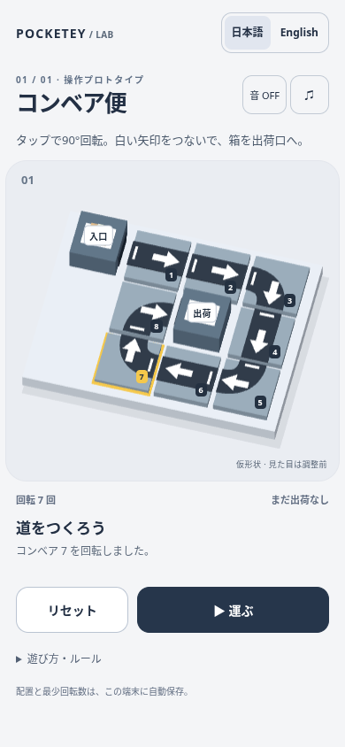

# コンベア便 / Parcel Turn — one-stage interaction prototype

This Draft PR adds `/prototypes/conveyor/` on branch `codex/conveyor-toy-factory`, based on `7adf12a`.
It is an unlinked, `noindex,nofollow` prototype; the existing sitemap filter excludes it.
No published game, home page, shared audio implementation, package manifest or deployment workflow is edited.

**Art matching is blocked, not complete.** The neutral gray models in these images are independently made interaction placeholders. They are not an implementation of the approved toy-factory reference.



## Play locally

```sh
npm ci
npm run dev -- --host 127.0.0.1
# Open /prototypes/conveyor/?lang=ja or ?lang=en
```

Tap any of the eight numbered conveyors to rotate it 90° clockwise. The short white bar is the inlet; the arrowhead is the outlet. Straight belts go straight; bends turn the traveling parcel right by 90°. The inlet machine and shipping machine stay fixed. Press Play to send one parcel; shipping succeeds only through the OUT machine's west/left opening.

The initial state intentionally fails on tile 1. One solution uses seven taps: **1 ×3, 3 ×1, 4 ×1, 5 ×1, 7 ×1**, then Play. The successful route visits tiles 1 → 2 → 3 → 4 → 5 → 6 → 7 → 8 → OUT. Tiles 2, 6 and 8 already face correctly.

- Play resolves the entire directed grid route before starting the visual motion.
- Wrong inlet, wrong shipping side, empty cell, board edge and repeated cell/incoming-direction each have a distinct terminal reason. A bad connection stops the parcel before it enters the bad tile.
- Rotation and repeated Play are rejected while running or paused, including synthetic button events.
- Pause, tab hiding, window blur and audio settings freeze delivery. Resume continues from the same animation position without catching up hidden time.
- After failure, tap to edit the current layout or Retry to run it again. After success, Play again keeps the layout for editing.
- Reset cancels the current delivery and returns to the initial layout. A late completion cannot resurrect a canceled run. Best turn count remains saved.
- Tab and Enter/Space operate the same tile buttons as touch. Esc pauses.

`model.ts` owns rules and phase guards, without Three.js or a clock. `motion.ts` samples the resolved route separately, including rounded paths through bends. `render.ts` owns the fixed orthographic view and lightweight geometry. No physics engine, purchased assets, extra stages, colors or branches are included.

## Reused Pocketey behavior

- Existing `LocaleHead`, `LanguageSwitch` and locale events/settings handle Japanese and English.
- Layout, turn count and best record use a versioned, validated `pocketey-conveyor-v1` save. Corrupt or blocked storage falls back to tab-local play.
- Sound reuses existing click, warning and clear samples and the shared audio gain functions. Its settings occupy only `pocketey-audio-v1.conveyor`, preserving existing game entries. This small prototype has effects and an effects-volume dialog; no music is added and no common audio framework is expanded.
- Failed attempts keep the layout for immediate correction. Reset and retry follow the existing games' device-local persistence conventions without changing their code.

## Verification

```sh
npx tsx --test tests/prototypes/conveyor/model.test.ts
npm run check
npm run check:games
npm test
npm run build
npx playwright test --config tests/prototypes/conveyor/playwright.config.ts
# With preview running at http://127.0.0.1:4341:
node tests/prototypes/conveyor/render-smoke.mjs
```

- 13 deterministic model/motion tests: known solution reached by ordinary taps, ports, wrong inlets/exits, empty cells, all four boundaries, synthetic cycle, route snapshots, running/paused guards, retry/reset, saves and animation sampling. A valid single-inlet source cannot enter a closed directed loop in the shipped layout; the cycle guard is exercised by a deliberately overlapping-source fixture.
- 5 Chromium browser scenarios: touch failure → correction → success, selection, reload/save, reset, pause, settings, synthetic blur, mid-run cancellation, idle rendering, Japanese/English, keyboard, isolated audio settings, 320px touch targets, WebGL loss and blocked storage.
- Existing game model suite: 24 tests. Full Astro check and game TypeScript check pass; Astro reports eight pre-existing hints. Build and existing portal/sitemap guards pass.
- New CI workflow is scoped to this prototype and performs model, type, build and browser checks. It has no deployment step.

The first 320px run found overlapping touch targets; a higher fixed oblique camera and 44px targets removed the overlap. Image review also caught a screenshot taken between resize and presentation. Unchanged canvas sizes now avoid clearing the buffer, and the browser captures wait for a presented frame.

See [render-smoke.json](evidence/render-smoke.json) for the separate rendering measurement. This is Chromium/SwiftShader with a 390×844 viewport, **not a phone GPU benchmark**. Draws are capped at 30 fps, pixel ratio at 1.5, with no shadow maps or postprocessing. Editing does not continually redraw. Real iOS/Android frame pacing, Safari and touch feel remain unverified.

Screenshots: [initial](evidence/interaction-initial.png), [partial real render](evidence/interaction-slice.png), [solved layout with selection](evidence/conveyor-operation-prototype.png), [delivered](evidence/interaction-success.png). These were inspected as actual local pixels, only for geometry, arrows, selection and layout.

The representative `conveyor-operation-prototype.png` was also saved to Library as **`libfile_84fbaf3bf818819189ff8959715ef2ff`** (`file_00000000e31c81f6b15d728b3c068d56`). The local file's Library identity metadata was applied successfully. This image documents the neutral operation prototype; it does not verify correspondence with the reference.

## Reference handoff blocker

The receiving environment read the current Library skill and `references/materialization.md`, used `prepare_materialize` with its own explicit destination, and invoked the current official transfer helper unchanged. TLS verification was never disabled. No alternate transfer route was attempted.

| User-provided reference | Download host | Result |
| --- | --- | --- |
| `libfile_d37411920e6081918e09806b8da3148e` — `A-toy-factory.png` | `sdmntprwestus2.oaiusercontent.com` | Preparation succeeded; one official download failed with `library file transfer failed: download failed`. |
| `libfile_66879d4646248191b43432074381a9b1` — `ChatGPT 画像 2026年10月9日 01_09_18.png` | `sdmntprbrazilsouth.oaiusercontent.com` | Preparation succeeded; one official download failed with the same message. |

Neither attempt exposed an HTTP status code or response body, so **403 is not asserted**. Neither produced a readable local image. The second attempt was for a newly supplied user file, not a retry of the first transfer. There were no further attempts or permission changes. Signed URLs and tokens are not retained here.

The required cream rounded board, teal belts, coral/mint rounded machines, warm soft light and reference proportions remain unimplemented. Once this receiving environment can inspect the approved pixels, start with one straight/bend/station render, review it, and only then extend the art to the full board. The draft must not be promoted as art-complete in its current state. Nothing has been published or merged to main.
