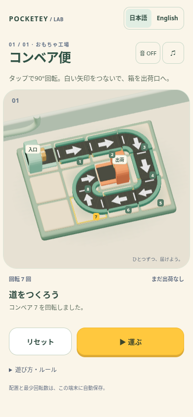

# コンベア便 / Parcel Turn — one-stage toy factory

This Draft PR adds `/prototypes/conveyor/` on branch `codex/conveyor-toy-factory`, based on `7adf12a`.
It is an unlinked, `noindex,nofollow` prototype; the existing sitemap filter excludes it.
No published game, home page, shared audio implementation, package manifest or deployment workflow is edited.

The toy-factory art implements the **user-approved written production specification**. The parent inspected the selected image, supplied the specification, and will compare these real renders with that image. This receiving environment did not obtain or inspect the reference pixels. The user explicitly authorized this workflow; reference downloading is finished, and the work is no longer waiting on it.



## Toy-factory rendering

- Fixed oblique camera, with the whole rounded tray occupying approximately 84% of the 390px screen width. All eight 44px tap targets remain separate at 320px.
- Separate cream `#F1DFC1` rounded cell tops on a muted green tray; thin seams retain the grid.
- Dark `#3F4545` belts, rounded teal `#5F9A8A` rails, shallow cross grooves and a few brass `#DDBD73` end caps. Bends use continuous quarter-circle bands; the white arrows and inlet bars rotate with the real ports.
- Mint `#94CBBB` input and coral `#ED825E` output machines use extruded arched shells, recessed dark mouths, trays and small lamps. The receiving cavity faces the route. Neither station is a solid box across the parcel path.
- The beveled parcel has two complete crossing bands. Its bottom is at 0.245 world units; the highest receiving belt is at 0.235. The inner arch clears the top of the box, and the back wall is beyond its final position. The delivered box remains visible on the tray.
- Warm upper-left light, rough painted surfaces and subtle generated contact shadows; ivory desk, pale mint wall and one broad pipe silhouette. No purchased assets, bloom, shadow maps, plants or shelving.
- Yellow `#FFC83E` is reserved for the primary Play control and selected tile. The interface identifies exactly one stage.

Rounded rail and machine shapes receive most of the geometry budget. The twelve cream tops are instanced; straight/bend parts are merged by material into two shared blueprints; all repeated shapes and materials are reused. Tiny grooves and wrapping bands use simple boxes instead of spending rounded geometry on subpixel detail. Model rules, coordinates, rotations, the known solution and motion paths are unchanged from `a928587`.

## Play locally

```sh
npm ci
npm run dev -- --host 127.0.0.1
# Open /prototypes/conveyor/?lang=ja or ?lang=en
```

Tap any of the eight numbered conveyors to rotate it 90° clockwise. The short white bar is the inlet; the arrowhead is the outlet. Straight belts go straight; bends turn the traveling parcel right by 90°. The inlet machine and shipping machine stay fixed. Press Play to send one parcel; shipping succeeds only through the OUT machine's west/left opening.

The initial state intentionally fails on tile 1. One solution uses seven taps: **1 ×3, 3 ×1, 4 ×1, 5 ×1, 7 ×1**, then Play. The successful route visits tiles 1 → 2 → 3 → 4 → 5 → 6 → 7 → 8 → OUT. Tiles 2, 6 and 8 already face correctly.

- Play resolves the entire directed grid route before starting the visual motion.
- Wrong inlet, wrong shipping side, empty cell, board edge and repeated cell/incoming-direction each have a distinct terminal reason. A bad connection stops the parcel before it enters the bad tile.
- Rotation and repeated Play are rejected while running or paused, including synthetic button events.
- Pause, tab hiding, window blur and audio settings freeze delivery. Resume continues from the same animation position without catching up hidden time.
- After failure, tap to edit the current layout or Retry to run it again. After success, Play again keeps the layout for editing.
- Reset cancels the current delivery and returns to the initial layout. A late completion cannot resurrect a canceled run. Best turn count remains saved.
- Tab and Enter/Space operate the same tile buttons as touch. Esc pauses.

`model.ts` owns rules and phase guards, without Three.js or a clock. `motion.ts` samples the resolved route separately, including rounded paths through bends. `render.ts` owns the fixed orthographic view and lightweight geometry. No physics engine, purchased assets, extra stages, colors or branches are included.

## Reused Pocketey behavior

- Existing `LocaleHead`, `LanguageSwitch` and locale events/settings handle Japanese and English.
- Layout, turn count and best record use a versioned, validated `pocketey-conveyor-v1` save. Corrupt or blocked storage falls back to tab-local play.
- Sound reuses existing click, warning and clear samples and the shared audio gain functions. Its settings occupy only `pocketey-audio-v1.conveyor`, preserving existing game entries. This small prototype has effects and an effects-volume dialog; no music is added and no common audio framework is expanded.
- Failed attempts keep the layout for immediate correction. Reset and retry follow the existing games' device-local persistence conventions without changing their code.

## Verification

```sh
npx tsx --test tests/prototypes/conveyor/model.test.ts
npm run check
npm run check:games
npm test
npm run build
npx playwright test --config tests/prototypes/conveyor/playwright.config.ts
# With preview running at http://127.0.0.1:4341:
node tests/prototypes/conveyor/render-smoke.mjs
```

- 13 deterministic model/motion tests: known solution reached by ordinary taps, ports, wrong inlets/exits, empty cells, all four boundaries, synthetic cycle, route snapshots, running/paused guards, retry/reset, saves and animation sampling. A valid single-inlet source cannot enter a closed directed loop in the shipped layout; the cycle guard is exercised by a deliberately overlapping-source fixture.
- 5 Chromium browser scenarios: touch failure → correction → success, selection, reload/save, reset, pause, settings, synthetic blur, mid-run cancellation, idle rendering, Japanese/English, keyboard, isolated audio settings, 320px touch targets, WebGL loss and blocked storage.
- Existing game model suite: 24 tests. Full Astro check and game TypeScript check pass; Astro reports eight pre-existing hints. Build and existing portal/sitemap guards pass.
- New CI workflow is scoped to this prototype and performs model, type, build and browser checks. It has no deployment step. The initial implementation passed run `37808664084`; the toy-factory revision was also checked locally with the same 13 model and 5 browser scenarios.

The first 320px run found overlapping touch targets; a higher fixed oblique camera and 44px targets removed the overlap. Image review also caught a screenshot taken between resize and presentation. Unchanged canvas sizes now avoid clearing the buffer, and the browser captures wait for a presented frame.

See [render-smoke.json](evidence/toy-factory/render-smoke.json) for the separate rendering measurement, including selected and running geometry counts. This is Chromium/SwiftShader with a 390×844 viewport, **not a phone GPU benchmark**. The active cap is 30 fps, not a claim of sustained performance: the observed software renderer can run below that cap. Pixel ratio is capped at 1.5, with no shadow maps or postprocessing. Editing does not continually redraw. The geometry budget is 15,000 triangles and 90 draw calls, checked independently from rule tests. Real iOS/Android frame pacing, Safari and touch feel remain unverified.

Current screenshots: [initial](evidence/toy-factory/interaction-initial.png), [partial real render](evidence/toy-factory/interaction-slice.png), [solved layout with selection](evidence/toy-factory/conveyor-toy-factory.png), [delivered](evidence/toy-factory/interaction-success.png). These were inspected as actual local pixels for geometry, colors, arrows, selection, box clearance and layout. Direct comparison with the selected reference belongs to the parent review.

The representative image uses Library identity **`libfile_84fbaf3bf818819189ff8959715ef2ff`**, updated from the gray interaction prototype to `conveyor-toy-factory.png` while preserving version history. The first toy-factory render was shared early as version 1; the verified representative is version 2. The gray screenshots in the parent evidence directory remain historical evidence for the initial interaction study.

## Reference handoff history and revised workflow

The receiving environment read the current Library skill and `references/materialization.md`, used `prepare_materialize` with its own explicit destination, and invoked the current official transfer helper unchanged. TLS verification was never disabled. No alternate transfer route was attempted.

| User-provided reference | Download host | Result |
| --- | --- | --- |
| `libfile_d37411920e6081918e09806b8da3148e` — `A-toy-factory.png` | `sdmntprwestus2.oaiusercontent.com` | Preparation succeeded; one official download failed with `library file transfer failed: download failed`. |
| `libfile_66879d4646248191b43432074381a9b1` — `ChatGPT 画像 2026年10月9日 01_09_18.png` | `sdmntprbrazilsouth.oaiusercontent.com` | Preparation succeeded; one official download failed with the same message. |

Neither initial attempt exposed an HTTP status code or response body, so **403 is not asserted**. Neither produced a readable local image. The second attempt was for a newly supplied user file. Later, after each of two user-confirmed allowlist changes, the user authorized one fresh check; both still failed at the official download step from `sdmntprbrazilsouth.oaiusercontent.com` with the same generic error. The worker made no permission changes, TLS changes or alternate-route transfers. Signed URLs and tokens are not retained here.

The user then explicitly changed the workflow: the parent inspected the image, translated it into production specifications, and authorized the worker to implement that text without claiming image access. The first toy-factory render was inspected and shared before the final verification, then simplified from approximately 20,500 to under 15,000 triangles. The parent can now compare the returned screens against the image and request visual adjustments. Nothing has been published or merged to main, and no dependency updates were made.
