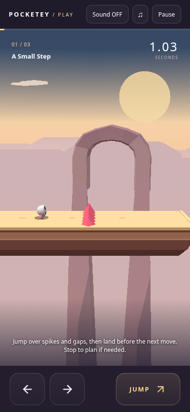
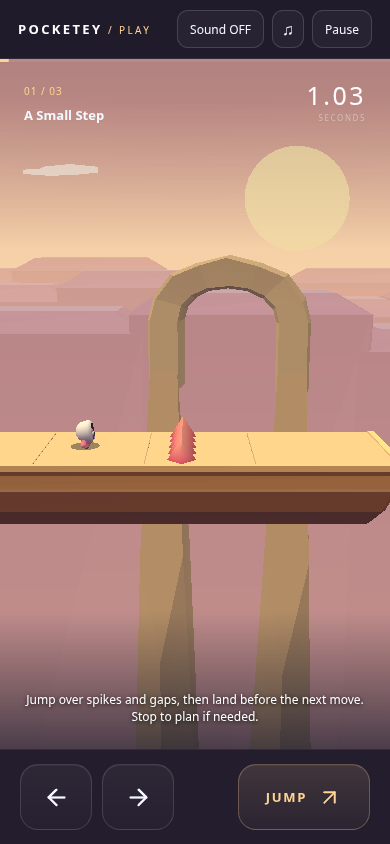
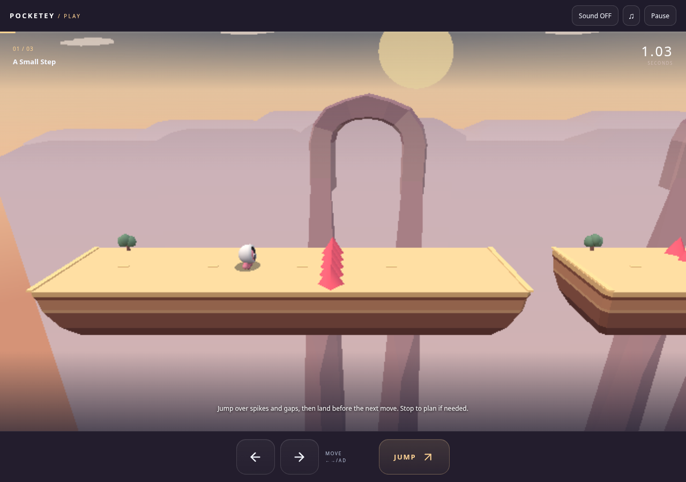
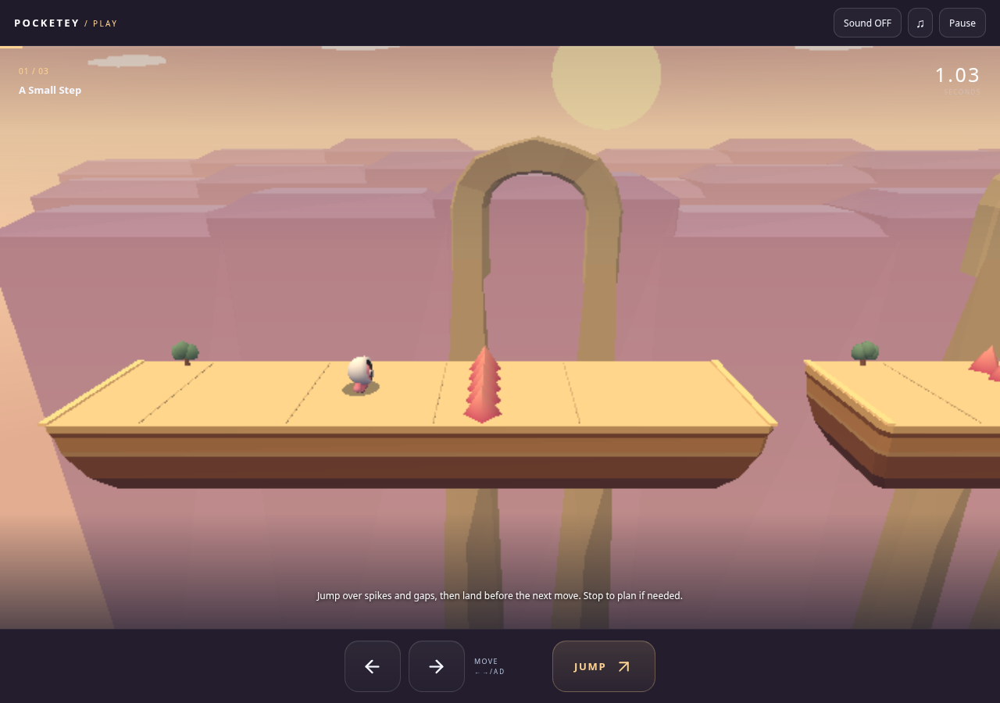

# Amber Step — warm sandstone garden

Independent draft from public main `7adf12ab464cfbb8e9d4e04917ad9f618a1a5f4b`, added after the parent explicitly extended the scope to Amber. Written production specification only; no reference images obtained. No merge or publication.

| Actual built game, same state | Before | After |
| --- | --- | --- |
| Mobile 390 × 844 |  |  |
| Desktop 1280 × 900 |  |  |

The real `/games/amber-step/` app runs with a Playwright clock paused before boot. Ordinary Stage 1 launch, ArrowRight for 240 ms, release for 800 ms; no game-state injection, camera/canvas/UI substitution or overlay hiding. Root diagnostics and framebuffers match exactly: running at x 1.167 / y 0 / z 0, grounded, zero jumps; the visible timer is 1.03 s. These are actual WebGL screenshots, not auxiliary renders. See `same-state.json` and the before/after reports.

Platforms retain every original position, normal, index, top surface, edge and gap. Their pale gold top has sparse full-width tile joints replacing the existing short center dashes; joints sit within the top and never extend its footprint. Broad ochre/terracotta layers gain a few quiet face variations. The original spike mesh/count/positions/heights receive coral vertex paint with a lighter tip and shaded side. The unchanged white skinned character has warm upper light and a restrained cool ground fill, retaining its face and purple feet.

The existing distant arch keeps its binary asset, geometry and placement; vertex colors warm the large stone segments and upper rim. Three large mauve/peach canyon layers sit behind it, with the same shoulders extending below view. No near floating island or false landing surface is introduced. Peach sky, pale gold sun and the existing few clouds complete the palette. No new textures, postprocess, shadow pass, dependencies, fine stones or foliage.

## Scope and validation

Production changes are `amber-scenery.ts` and **Amber-only branches** in shared `render.ts` / `art.ts`. Camera, gameplay models/levels, collision, movement, character geometry/rig, UI, sound, saves, all assets and the top page are untouched.

- TypeScript, production build/portal guard, nine existing shared model tests and whitespace checks pass.
- Three unchanged targeted browser tests pass: ordinary Amber multi-touch clears all three stages and verifies unlock/save/reload/reopen; corrupt/blocked storage and scoped reset; simultaneous move+jump, touch cancel, layout, performance and navigation. `functional-report.json`, `functional-completion.json` and input timing preserve evidence.
- Native stage 3: **60.00 FPS / p95 16.7 ms**. Touch-controls sample: **60.00 FPS / p95 16.7 ms**. The original 45 FPS and p95 40 ms limits are unchanged.
- `geometry-check.mjs` is an explicitly auxiliary diagnostic. It checks every Amber platform position/normal/index in all three stages, original character skin attributes/transforms, spike geometry/instances, cameras and model states. All match public main.
- Because the renderer is shared, the same diagnostic also compares the **entire Orbit mesh geometry, vertex paint, shader source and transforms in all three stages**. Hashes and cameras match exactly. No Orbit visual change is included.

## Drawing cost

All three Amber stages remain **9 draw calls**. The additional distant canyon layer adds 400 triangles: stage 1 5538→5938, stage 2 5870→6270, stage 3 6522→6922 in the fixed diagnostic. Materials still enter the existing static batches; there are no additional per-frame loops or texture updates.

| Native sequential comparison, mean of two samples | Before | After |
| --- | ---: | ---: |
| Mobile FPS / p95 ms | 59.85 / 16.8 | 60.00 / 16.7 |
| Desktop FPS / p95 ms | 50.94 / 33.35 | 47.53 / 33.40 |

This uses the built route at the same safe Stage 1 starting position, real clock, before/after/after/before per viewport, one active page, 220 intervals with 20 warmup intervals omitted. The standing player keeps the full native app and animation running without driver timing differences. All samples remain playing without errors. Desktop mean is about **6.7% lower** in this short SwiftShader comparison, with baseline samples ranging 48.78–53.10 FPS; this cost/variation is disclosed and is not described as zero regression or hardware performance. No threshold was lowered and no failing performance run was reclassified. Final integration/device performance remains for the parent's review.

Reproduce with main production preview 4381, candidate preview 4386, baseline dev 4383 and candidate dev 4387. Run `ART_BASE=<preview> node docs/release/amber-sandstone/capture.mjs before|after`, `geometry-check.mjs`, `compare.mjs`, and `npx playwright test --config docs/release/amber-sandstone/local.config.ts --grep 'amber-touch.*three stages|corrupt/blocked storage|touch simultaneous move'`. Existing browser and TLS/OS/network security settings are preserved; no unrelated whole CI was repeated.
