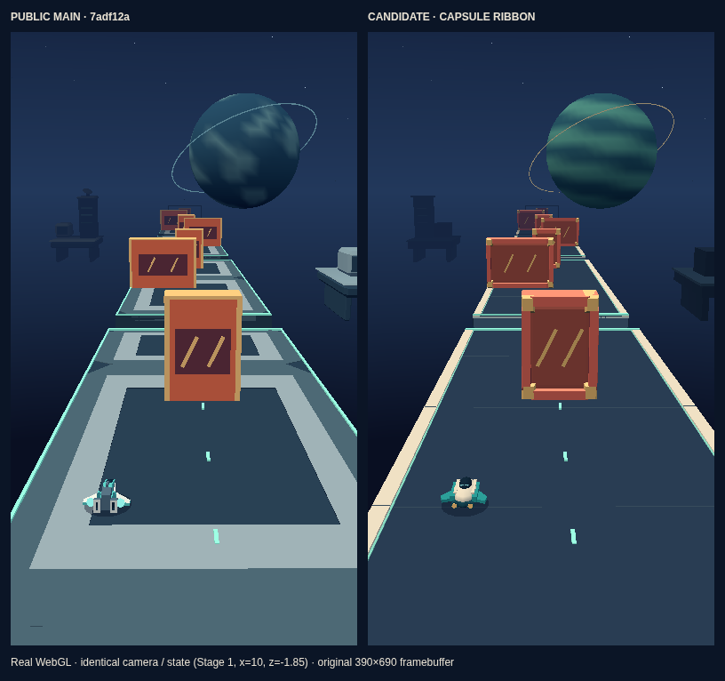

# Orbit Ribbon — capsule / ribbon visual pass

公開 main `7adf12ab464cfbb8e9d4e04917ad9f618a1a5f4b` を起点とした独立案。アイボリーとターコイズのカプセル、閉じた赤いシャッター、暗い中央床と細い縁パネルへ整理した。PR #22 のシャッター試作は取り込んでいない。公開・main への merge は行っていない。



[実ゲーム画面（通常の開始・左右入力、UI あり）](evidence/after-native.png) / [desktop・穴でのジャンプ](evidence/after-desktop-gap.png) / [mobile・stage 3](evidence/after-mobile-stage3.png)

## 保持したものと造形

カメラ、速度、ジャンプ、当たり判定、道・穴・障害物、3 ステージ、UI、文字、音、保存形式は保持。[対象ソースの SHA-256 と不変照合](evidence/source-invariants.json)。他作品やホームのソース・素材は変更していない。共有 `render.ts` / `art.ts` の変更は Orbit 分岐の採用と不要になった Orbit 素材の読み込み削除だけ。

- 機体の外寸は公開モデルと同じ X `[-0.4, 0.4]`、Y `[0.12, 0.504]`、Z `[-0.42, 0.42]`。濃いキャノピー、明るい両肩、短い後退翼、琥珀色の二つの灯を一つの不透明バッチに結合。既存の中心基準の寛容な当たり判定は変更しない。
- 床は暗い中央、アイボリーの側縁、ミントの細線、二段の側面。少数の線でパネルを表現し、見えない小箱の裏面を増やさない。すべての部品を元の足場の前後端内に収めた。
- シャッターは全面を塞ぐ赤い板を背面に持ち、浅い面取り、凹んだ暗赤色の中央、金色の両端、二本の斜線を配置。各部品は元の衝突幅・高さ・奥行きの内側。穴やアーチを作らない。
- 惑星の半径 7.5、位置、リング半径 10.3 と傾きは維持。青緑の帯と控えめな金色リングへ変更。基地と岩は道を邪魔しない暗い色へ。

既存の頂点色バッチ、暖色の主光、青系環境光、接地影を使用。bloom、追加パーティクル、ポスト処理、テクスチャ、新規購入素材はなし。機体・床・シャッター・基地は TypeScript の自作形状。既存の CC0 の岩・隕石だけを再利用。旧機体・床・基地 GLB（生ファイル合計 **84,808 bytes / 3 files**）のリクエスト が不要になった（リポジトリ内の旧素材は削除していない）。

## 実測

同一 Chromium 151 / SwiftShader、同一カメラ・状態・描画解像度で比較。通常の本番ビルドの入力測定も同じカウントを記録する。desktop の canvas は CSS 1280×566 / buffer 889×393、mobile は 390×690 / buffer 390×690。解像度上限は変更なし。

| 固定状態 | 公開版 draw calls → 候補 | 公開版 triangles → 候補 |
|---|---:|---:|
| Stage 1・接近 | 9 → 8 | 7,724 → 5,696（−26.3%） |
| Stage 1・穴の上 | 8 → 7 | 7,704 → 5,676 |
| Stage 3・切り返し | 9 → 8 | 8,700 → 6,552（−24.7%） |

[before の状態・環境・カウント](evidence/before.json) / [after](evidence/after.json)。物体ごとの draw call 増加は避け、共有ジオメトリを使用した上でレベルと機体をそれぞれ結合している。

本番ビルドの 3 回の交互測定（AB / BA / AB、desktop と mobile、各 1.5 秒）は [全 12 サンプル](evidence/performance-comparison.json) を保持。desktop は公開版 1 件・候補 1 件がウォームアップ後のサンプル不足で無効。mobile FPS は公開版 44.6 / 54.7 / 46.0、候補 43.9 / 52.9 / 32.2。desktop の唯一の有効な同ラウンド対は 16.1 → 17.1 FPS、p95 83.4 → 166.5 ms。ばらつきと悪化したサンプルもあり、速度改善・性能基準合格は主張しない。GPU 実行時間ではなく rAF 間隔と CPU/driver submission の計測。

## 検証と残課題

- ゲーム TypeScript: pass。Astro check: 0 errors / 0 warnings（8 hints）。production build と portal guard: pass。[ログ](evidence/validation/)
- 既存のゲームモデル 9 件 + 新規の描画境界 3 件: **12/12 pass**。新規検査は機体の旧外寸・1 バッチ、全シャッターの元の境界と塞がった面、全ステージの穴を塞がない床を確認。
- 最初の候補の既存 Orbit ブラウザ検査: **6/9 pass**。保存互換、失敗/リトライ・フォーカス・20 回の再開始、狭幅メニュー、安全領域、ジャンプ時の読み込み、GLB 失敗時の完走・保存が通過。[全レポートとログ](evidence/initial-local/)
- 最初の keyboard は 3 ステージを通常入力でクリアし、保存・reload・別ページ再読込・stage 3 再開始まで到達。ただし **22.40 FPS / p95 83.3 ms** で既存の **45 FPS / p95 ≤ 40 ms** 基準に失敗。touch は stage 1 で入力完走に失敗。context-loss 検査も事前の stage 1 完走に失敗したため、回復動作まで到達していない。
- 面数削減後の最終候補 `47537b4` の同じ 9 件は **5/9 pass / 4 failed / 0 retries**。[最終レポートと全ログ](evidence/final-local/)。リトライ・20 回再開始、狭幅メニュー、安全領域、ジャンプ表示、GLB 失敗時の完走・保存は pass。keyboard は 3 ステージ、保存・reload・別ページ再読込・stage 3 再開始まで通過したが **19.66 FPS / p95 100 ms** で既存基準に失敗。touch は stage 1 の 2 個目の穴で失敗。保存互換テストも通常入力の stage 1 完走部分で失敗。context-loss テストは事前の stage 1 完走で失敗し、回復検査に未到達。
- 同環境の公開 main の通常入力検査は **0/2 pass**。[公開版のレポートと入力記録](evidence/baseline-local/)。keyboard は 3 ステージ・保存を完了したが **16.77 FPS / p95 100 ms**、touch は stage 2 の障害物で失敗。公開版の失敗を候補の免除理由にはしていない。計測結果の原因を環境だけには断定できない。
- 基準・入力ドライバー・タイムアウト・既存検証設定は変更していない。同じ失敗の再試行はせず、全ゲーム CI、他ブラウザ、物理端末での最終受入は未実施。[検証した runtime commit、ビルド・設定ハッシュ](evidence/review-manifest.json)。

**[Draft PR #26](https://github.com/shou773/pocketey-portal/pull/26) のまま返却する。性能・タッチ完走と context-loss 回復の未確認は公開前の残課題。** 無関係な全ゲーム CI の反復は行っていない。

## 画像の由来・再現

比較画像は実 `createView` / `draw` に同じ fixture state を渡した WebGL 出力。物理の完走証明とは区別する。`*-native.png` は本番ビルドの開始ボタンと通常の左右入力で進み、撮影のためだけに rAF を止めた画面。Blender や生成画像、外部の参考画像は使っていない。

初回の dev-server 比較は、二つの checkout が Vite の依存キャッシュを共有して Three の型が分裂し、公開版 GLB が結合から欠落していたため**棄却**した。[棄却画像](evidence/initial-local/rejected-dev-cache-comparison.png) は採用しない。現在の比較は renderer と GLTFLoader を同一バンドルに固定し、本番ビルドの draw calls / triangles と一致することを確認したもの。

```sh
# それぞれ通常の npm run build を完了した checkout を指定
node scripts/orbit-review-server.mjs /workspace/orbit-baseline 4343
node scripts/orbit-review-server.mjs /workspace/pocketey-portal 4344
ORBIT_BASE_URL=http://127.0.0.1:4343 ORBIT_SOURCE=7adf12ab464cfbb8e9d4e04917ad9f618a1a5f4b node scripts/capture-orbit-ribbon.mjs before
ORBIT_BASE_URL=http://127.0.0.1:4344 node scripts/capture-orbit-ribbon.mjs after
ORBIT_BASE_URL=http://127.0.0.1:4344 node scripts/capture-orbit-native.mjs after
node scripts/compare-orbit-rendering.mjs /workspace/orbit-baseline/dist dist
npx tsx --test tests/games/model.test.ts tests/games/orbit-art.test.ts
npx playwright test --grep 'orbit|licensed UI|failure/retry'
```

レビュー用モジュールは検証サーバーのメモリ内だけで生成し、公開ファイルや本番ゲームには組み込まない。既存の承認済み Chromium flags を使用し、TLS・OS・ネットワークのセキュリティ設定は変更していない。
