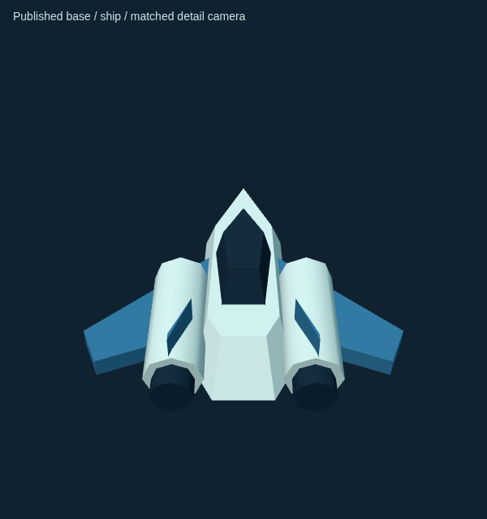
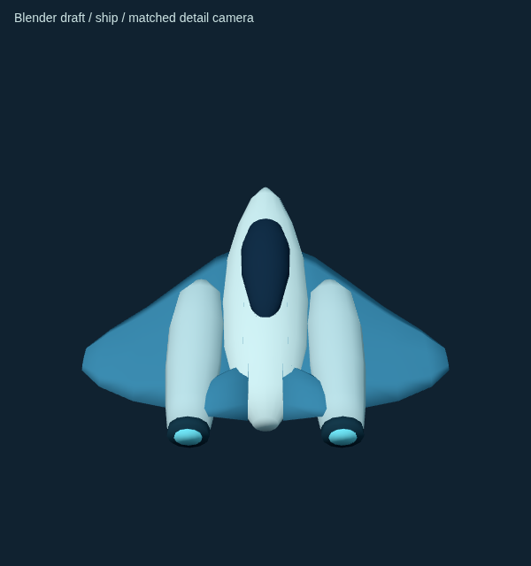
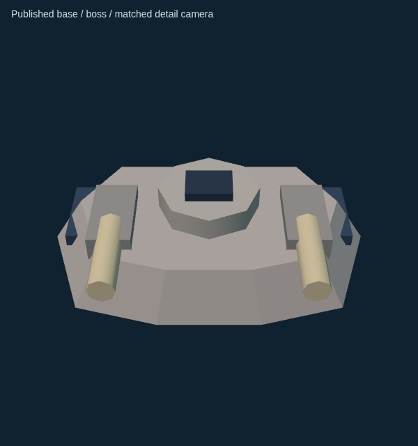
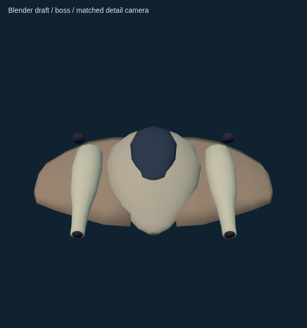
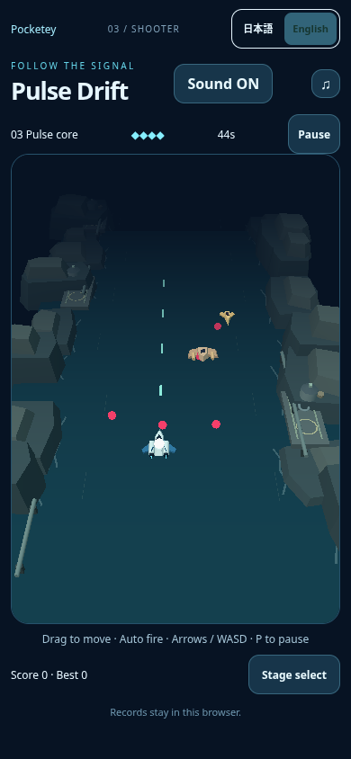
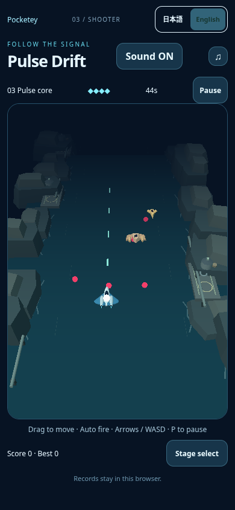
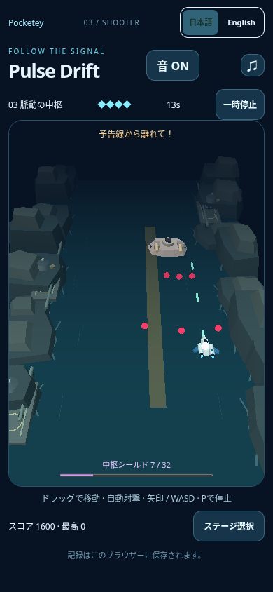
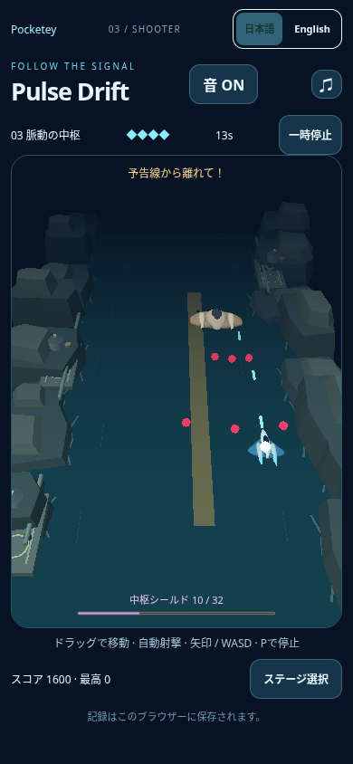
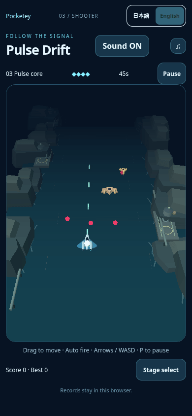

# Pulse: Blender flow-model direction review

Independent **draft**, base9538edc3ff8e7c72362e4baab5b0f8331a2c49e8. User requested another shape pass because published objects still look box-like. Parent will show these images to the user before direction approval. No long whole-game CI, merge or publication.

## Selected hero objects

Only the interceptor and Stage3boss were redesigned. The old aircraft's extruded polygon fuselage, angular canopy and separate cylindrical engines, and boss's block/barrel stack were the most prominent examples. Small enemies and the whole coastal background remain unchanged; no decorative background additions to disguise hero quality.

Original dedicated Blender lofts use elliptical cross-sections to connect nose, shoulder and tail. The interceptor has a rounded tapering fuselage, swept thin airfoil wings, a continuous dark curved canopy and smoothly tapered paired engine nacelles emerging from the shoulders. The boss is a broad manta wing-body with curved shell, embedded rounded weapon fairings and a large dark dorsal dome. Ivory/blue long player silhouette vs wide ochre enemy silhouette. Smooth outward normals on curved surfaces; one combined mesh per model, one vertex-color material, no texture, shadow or postprocessing cost. Runtime uses existing Lambert materials, not GLB's PBR shader.

Source: `art/pulse/pulse-vehicles.blend` (Blender4.3.2), reproducible `scripts/blender/pulse_vehicles.py`. Runtime GLB60,220bytes, two nodes:interceptor1168triangles/608Blender vertices, boss1192/616. Export splits attributes as needed; asset-validation.json records exported triangles, hash and unit-normal bounds. All geometry is original project-authored; no external artwork, paid asset or new contract. Optional regeneration: `blender -b --python scripts/blender/pulse_vehicles.py -- /absolute/repo/root`.

## Matched detail views

| Model | Published base | Blender draft |
| --- | --- | --- |
|Interceptor|||
|Boss|||

Detail-only local Three gallery600x640/DPR1, same before/after camera/light/scale per model:perspective35deg, camera(0,d,d*15/14), lookAt(0,.12,0), d2.1player/3.3boss; existing hemisphere/directional lights and Lambert vertex paint. Baseline geometry comes directly from the unchanged procedural fallback authoring in view.ts, draft from GLB. No collision marker or environment in this **detail gallery**; gameplay camera and effects are unchanged. Temporary gallery helpers at `/tmp/make-pulse-gallery.mjs`, `/tmp/capture-pulse-gallery.mjs`, local4352. Viewed the actual rendered PNGs; no generated/synthetic comparison artwork. Normal screen comparison below is the criterion for direction, not just Blender usage or enlarged curves.

## Actual unchanged game camera

| Scene | Published base9538 | Draft |
| --- | --- | --- |
|Mobile native Stage3 near4s|||
|Mobile native boss + warning near35.3s|||

390x844/DPR1, ordinary local HTTP preview, native touch. First pair uses18CSSpx-left/release; second uses the existing bounded cautious native driver solely to reach boss/warning. No model/state/DOM/camera writes, pause or effect suppression. Episodes are not exact simulation-state pairs:near4s baseline4.083/candidate4.117; boss captures differ slightly in time, surviving entities, bossHP and score. AdjacentJSON contains actual state/render counters/errors[]. Both boss episodes have playerHP4. Geometry is descriptive only; all collision coordinates/radii, invulnerability, warning, shields, enemyHP/durations, controls/camera/audio/settings/saves and other games remain unchanged.

Unpaused3.867–6.333s actual native-touch episode,41chronological browser PNGframes with real timestamp-derived GIF timing and palette conversion. No interpolated/synthetic frames; GIF contains no audio. Natural damage4→3→2HP,9hull-off frames, white core stays visible in all41 (minimum104whitepixels). The motion is stationary after a native gesture for focused core/readability capture, not a human skill test. Viewed hull-off frame009 plus normal and boss screenshots. No page errors. Full rawframes/diagnostics writer-local `/workspace/asset-intake/pulse-blender-flow/motion/`; compact motion.json retained here. No direct-listening/physical-device claim.

## Geometry and preliminary performance

Same two vehicle draws as fallback; no extra model draw/material. Actual near4s rendercounter14calls:baseline2700 vs candidate3900triangles (not identical actors). Boss screenshot14calls:2944 vs4832triangles; sampled native boss-window maximum14calls/5060triangles vs baseline14/3104. Vertex/shader work therefore increases; below6000 sampled triangles is not an FPS guarantee.

One complete balanced baseline/candidate/candidate/baseline comparison per mobile/desktop, fixed5s window after1.5s ordinary Stage2 launch, initialmute, same Chromium/SwiftShader/framebuffer. All8observationsplaying/errors[]. `performance.json` retains every raw interval and start/endstate. Baseline camera/canvas exactly preserved (mobile364x521, desktop578x556). This is preliminary hero-load measurement; no boss FPS gate or real-device test yet.

| Device | Basefps | Draftfps | Basep95ms | Draftp95ms |
| --- | --- | --- | --- | --- |
|Mobile|32.26 /27.18|28.51 /27.66|66.6 /83.3|66.7 /66.7|
|Desktop|14.06 /20.64|34.65 /25.44|116.7 /116.7|50 /83.3|

Large run-to-run variability and low baseline make universal performance/no-regression claims unjustified. Mobile mean draft28.09vs base29.72 (~5.5%lower) remains a risk, not a proven isolated geometry regression; desktop is higher in these samples but not a guarantee. **Not performance-approved or ready to publish.** Direction review precedes any bounded retopology/performance follow-up; no endless tuning to obtain a green measurement. An earlier comparison attempt was interrupted before any complete sample because the boss capture was still running; no numeric result was used. The complete comparison was sequential with no other QA browser launched.

## Loading and scope checks

One async local GLBload replaces only ship/boss geometry, retains inexpensive paint and original core/exhaust transforms. Missing/malformed load retains procedural fallback; gameplay never waits. Late response after dispose frees clone/import buffers; obsolete fallback geometry is disposed on successful replacement. Export has no textures/material variants. Focused normal load and forced-art-request failure both pass start/pause/retry/soundsave+reload without page errors (fallback.json). This is not a full stage-clear/save regression suite, deferred until direction approval. `npm run check:games`, existing9shooter model tests, telemetry-disabled build/portal guard and whitespacecheck pass.

The first candidate screenshot mistakenly contacted an older preview because4341/4342were occupied; Astro's actual candidate port4343 was then verified and GLBreadyconfirmed. That wrong-grid capture is excluded/kept labeled invalid outside repository. All figures above use verified baseline4340/candidate4343. No HTTPS or proxy/TLS exception used; no remote asset/network restriction bypass. Previously documented strict browser HTTPS limitation remains unrelated and unresolved.

User/parent direction approval is required before longCI/integration/publication. The explicit current authorization is to provide this concrete visual draft; no additional difficulty changes proposed from automated scores.
