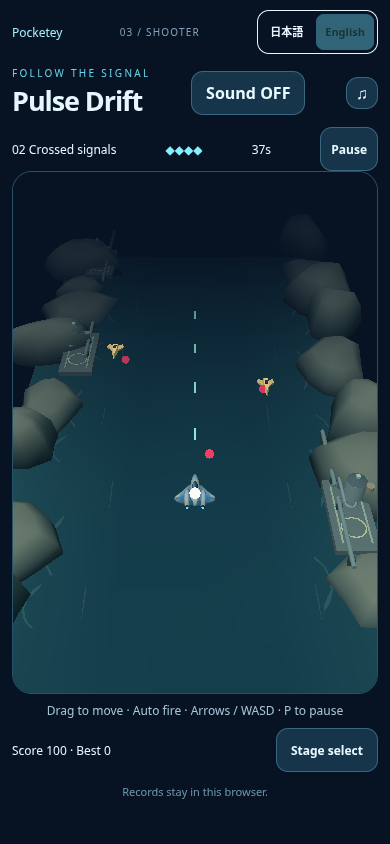
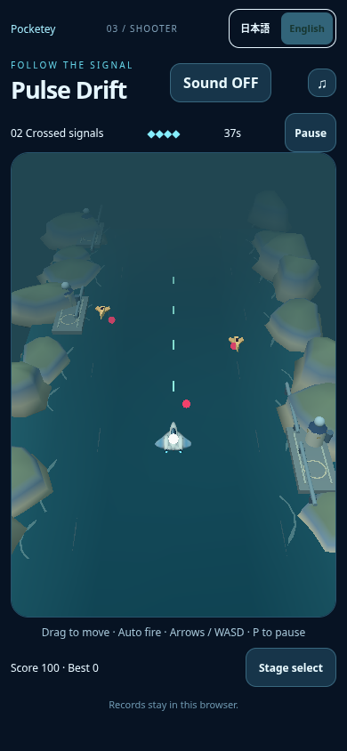
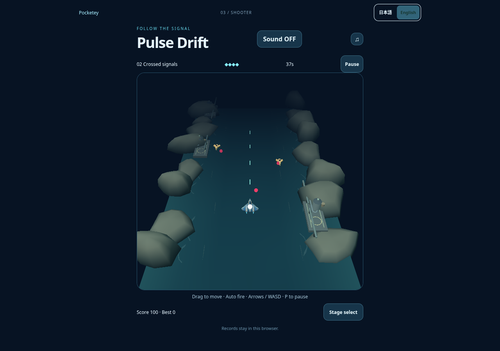
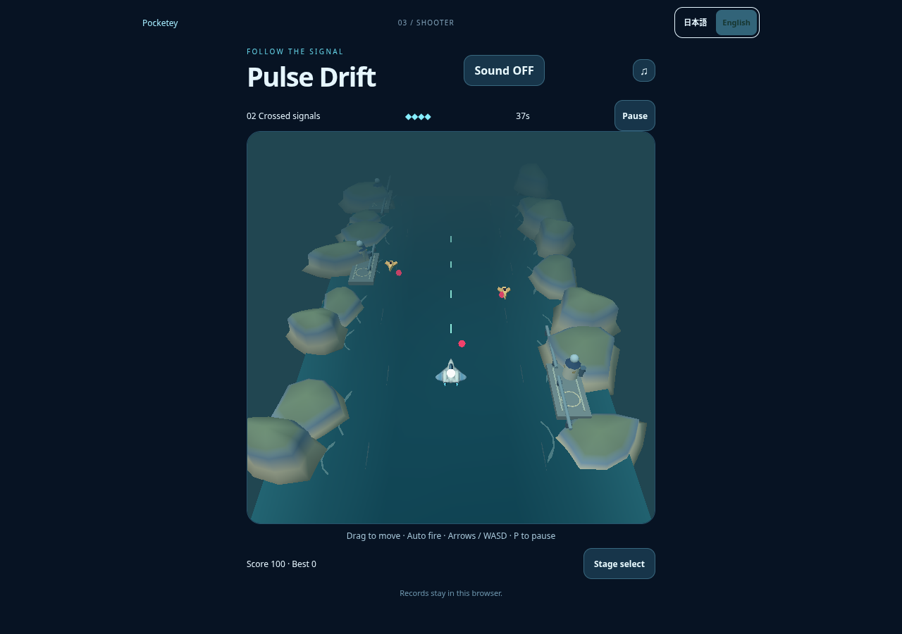
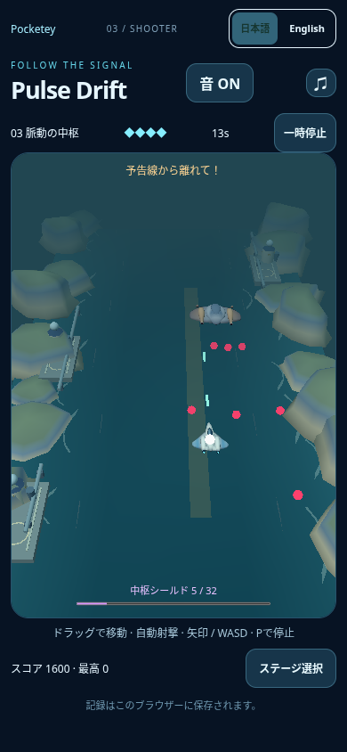

# Pulse Drift — clear teal coast

Independent draft from public main `7adf12ab464cfbb8e9d4e04917ad9f618a1a5f4b`. Only `src/games/prototypes/shooter/view.ts` changes in production. Written art direction only; no reference images acquired. No merge or publication.

| Actual built game, same state | Before | After |
| --- | --- | --- |
| Mobile |  |  |
| Desktop |  |  |

Built native game route, ordinary Stage 2 launch, a clock paused **before boot** and advanced 6000 ms for the screenshot. No state, camera, UI or canvas replacement. Gameplay diagnostics match exactly across each pair: t 5.95, player x 0 / y 1.8, HP 4, score 100, all enemy/bullet/beam positions, projection and bounds. See `same-state.json`, `before.json` and `after.json`. The diagnostic HUD samples every six frames; it is not the timestamp of the final rendered frame. These are actual WebGL game images, not auxiliary renders.

Two shared rock profiles now separate muted grass crowns, blue-gray walls and pale sandy ledges; one inset ring supplies the step. Existing coast instance positions, rotations, scales, outermost width and crown height remain unchanged. Water has a broad teal vertex gradient and the existing sparse foam strokes. Three batched facilities use ivory/navy towers, small round radar domes and three quiet amber windows each. The existing curved player/boss GLB receives new vertex paint only: the player retains its white/blue shell with clearer canopy and wing light, and the boss separates blue-gray body from bronze shoulders. The independent white core is untouched.

No vehicle vertex positions/normals, camera, gameplay bounds, collision radii, enemy or bullet colors/positions, beam color/opacity, controls, timing, stages, UI, sound or saves change. No asset binary or dependency changes. No extra draw call, texture, lighting pass, wave simulation or postprocessing.

This additional image uses the existing ordinary native-touch driver to reach the Stage 3 boss. It is unpaused live gameplay, not an exact-state before/after pair. The adjacent JSON brackets screenshot timing; HP remains 4 and page errors are empty. It shows the original red bullets and amber warning lane against the revised coast.

## Checks and load

- TypeScript, production build/portal guard, all nine unchanged shooter model tests and whitespace checks pass.
- The existing `tests/prototypes/ui.mjs` passes eight cases: four viewport sizes with keyboard/touch movement and release, touch cancellation, pause/locale/blur/retry, sound save, plus corrupt storage, blocked storage, unavailable WebGL and context loss. Only the preview port is supplied; the test source is unchanged. See `ui-report.json`.
- The unchanged natural-damage core test passes: 69 real frames, 19 hull-off frames, at least 104 white core pixels in **every** frame, natural HP 4→3, all observations playing, no page errors. `core-check.json` preserves selected-frame diagnostics; `core-hull-on.png` / `core-hull-off.png` are original captured frames. Full raw frames regenerate under ignored `test-results/pulse-damage-core/`.
- Matched representative geometry grows 4184→4588 triangles (+404); both remain 15 draw calls. The extra cliff ring is +320 triangles, facilities +84. Ship/boss meshes, all instance counts and framebuffer sizes are unchanged.

| Native sequential benchmark, mean of two samples | Before | After |
| --- | ---: | ---: |
| Mobile FPS / p95 ms | 60.00 / 16.8 | 59.69 / 16.8 |
| Desktop FPS / p95 ms | 55.57 / 33.30 | 54.12 / 33.35 |

`performance.json` records a balanced before/after/after/before sequence per viewport, one active browser page, real clock, five seconds after ordinary Stage 2 launch. All eight samples remain playing with no page errors. Entity count varies with native timing: observed maxima are 16 calls / 4220 baseline and 16 / 4624 candidate. The short desktop mean is about 2.6% lower and mobile about 0.5% lower; this is recorded rather than asserted to be zero regression. No performance threshold is lowered or existing failure reclassified. These SwiftShader samples do not establish physical-device performance.

Reproduce: run the unchanged baseline build on 4381 and candidate on 4384 (also 4331 for the existing UI script). `ART_BASE=http://127.0.0.1:4381 node docs/release/pulse-clear-coast/capture.mjs before`, then candidate `capture.mjs after`, `compare.mjs`, `node tests/prototypes/ui.mjs`, `PULSE_CORE_BASE_URL=http://127.0.0.1:4384 node tests/prototypes/damage-core.mjs`, and `capture-boss.mjs`. Source modules/model/assets for other games are untouched. Existing Chromium settings and TLS/OS/network security remain unchanged.
