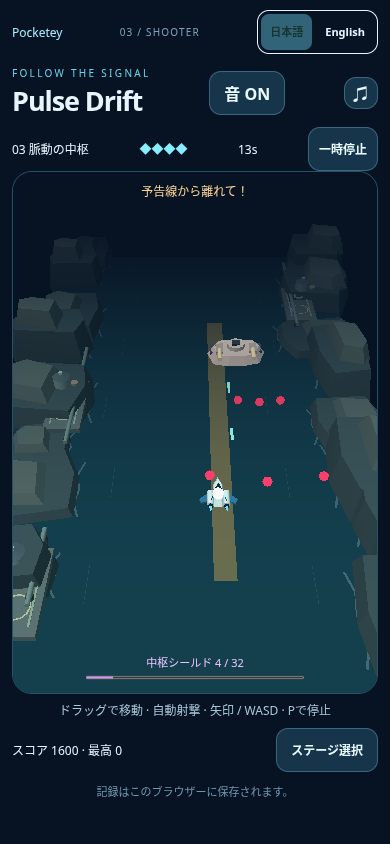
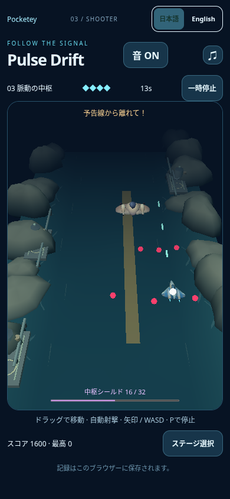
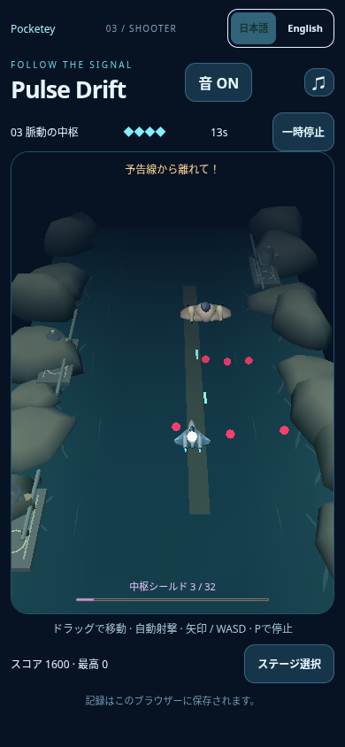

# Pulse boss/warning bounded budget check

Historical d106 check: the final two-profile optimization and all alternating samples are recorded in [pulse-final/REVIEW.md](../pulse-final/REVIEW.md). Earlier single samples are preserved here, not presented as final-candidate evidence.

Parent approved the e93 visual direction and requested one bounded performance/budget pass before any longCI, merge or publication. This record supersedes e93 coast geometry counts only; its aircraft/surface direction is retained. **No performance approval or release approval is claimed.**

## Results first

|Variant|Boss/warning FPS|Frame p95|Boss peak draws/triangles|All sampled play peak draws/triangles|
|---|---:|---:|---:|---:|
|Current published main9538|45.74|33.4ms|14 /3116|14 /3116|
|Accepted visual drafte93, before budget trim|9.95|216.7ms|16 /6648|17 /6660|
|Minimal background trim|42.02|33.4ms|16 /5752|16 /5752|

The original e93 exceeded the unchanged6000triangle limit. Trimmed candidate's observed maximum5752 is248below it. The optimized sample was8.12%slower than published main, with equalp95. These are single short SwiftShader software-renderer episodes, not physical-phone results, balanced multi-run statistics or an all-possible-state bound. The large e93 slowdown is observed; the cause has not been isolated. Do **not** claim geometry trimming alone caused the entire4×FPS difference, stable device performance, or complete performance recovery. Prior rounded-model performance concern remains unresolved.

## Actual normal smartphone boss/warning renders

|Published main|Accepted e93 before trim|Minimal trim|
|---|---|---|
||||

Inspected original local screenshots:normal390×844/DPR1 camera, actual native touch play, boss+pink bullets+white player core+amber warning all present. No state writes, pause, camera change, suppressed actor/effect or image editing. Paired scenes are separate episodes; adapted steering produces different player positions/projectiles/boss health. All had4playerHP andplay at the screenshot's recorded beforestate; image sampling took some time and later HP/status may change. RawJSON preserves before/after/final states. Trimmed run subsequently won at36.07s with3HP; this is incidental to measurement, not difficulty modification or a requested three-stage clear test.

## Exact source and conditions

Normal git fetch confirms origin/main9538edc3ff8e7c72362e4baab5b0f8331a2c49e8. Published Pulse module at `https://www.pocketey.com/_astro/pulse-drift.astro_astro_type_script_index_0_lang.CCbnWBxE.js` was fetched with ordinary urllib/systemCA verification; its SHA256342caa663bd1e5ded7e72ba6885a348fa031ce5be676a37049170973899dcdf9 matches local9538built module exactly (public-runtime-match.json). Same main's view/model/app source is used by the baseline. LocalHTTP is used for browser measurements; this is not a new strict-browserHTTPS certificate claim. No certificate/proxy/refusal bypass.

Three sequential independent local Chromium/SwiftShader sessions: e93→publicmain→trim. Same390×844/DPR1 touch context, Stage3/JA, soundON, new storage/context, prior cautious native steering algorithm and unchanged camera. Two previews only; no simultaneous game runs. Typecheck/build for trim ran during baseline's early game preparation and completed before its measured boss interval. Probe wraps WebGL2triangle draws to count real submitted calls/triangles; separateRAF observes intervals/counters and read-only existing diagnostic state. Same probe/driver in every case; overhead is included. Diagnostic state publishes every6game renderframes, so interval boundaries can be approximate. Boss performance uses state time30.2≤time<35.4, boss present/play, excludes screenshot capture; beam warning and active frames occur in this window. Sample counts66/234/222; summed interval durations6633.1/5116.4/5283.2ms. All-play maxima cover launch through the retrieved post-screenshot trace, not every future possible encounter.

Reproducible bounded collector:`scripts/measure-pulse-coast-boss.mjs`; set `PULSE_ART_BASE_URL`, `FLOW_PHASE`, `PULSE_ART_SHA`, optionally `PULSE_VIEW_HASH`/`PULSE_BUDGET_EVIDENCE`. BaselineHTTP4391, candidate4392. Temporary initial collector attempted a38second endpoint; game ended first and it produced no valid measurement record. Only collector endpoint was corrected to35.4; no game/input/difficulty change and no repeated whole suite. Candidate source hash is stored in adjusted capture/summary; e93 source exactSHA recorded. No fresh longCI/FPSiteration, main write or merge.

## Minimal correction, no other visual tuning

Water subdivisions12×16→6×8:384→96triangles (save288). Three rock profiles12segments/5rings→10segments/4rings:61→41vertices and108→70triangles each;16instances save608. The redundant small crown ring is removed while original extents, wet-toe/shoulder/main-crown rings, top point, deterministic contour, smooth normals and color layering remain. Total reduction896triangles. Geometry-check.json confirms all three actual authored geometry positions/colors/normals finite, normal unit error≤4.1e-8. No changed surface palette, shore/ripple design, landmark, scene layout, lighting or animation. No actor, whitecore, bullet, beam warning, GLB, Blender source, camera, collision, controls, difficulty, audio or save change. The ordinary smartphone capture retains the approved rounded-bank direction.

Three cliff batches retain the same two extra background draws. Current coast cost relative previous angular background is nominal+668triangles instead of+1564. Triangle limit6000 is unchanged, and no quality assertions or tests are relaxed. TypeScript gamecheck, build+portal generation checks, JS syntax check and whitespace check passed. No new full regression/device/whole-suiteCI approval.

If the parent considers the observed~8%short-sample slowdown too large, the next concrete background-only choice is three→two reusable rock profiles/batches (16positions/scales/yaws preserved), reducing one draw without losing the rounded erosion direction. Additional small savings:8rather than10circumference segments would save224triangles with smooth normals; water4×4rather than6×8 saves64more but has limited expected benefit. These are **proposals only**, not additional changes. Do not lower gameplay render quality or inflate limits. Stop here for parent judgment rather than repeated deep optimization.

Library helper401 remains unresolved. Evidence is committed in PR/local files; no claimed Library upload, merge or publication.
