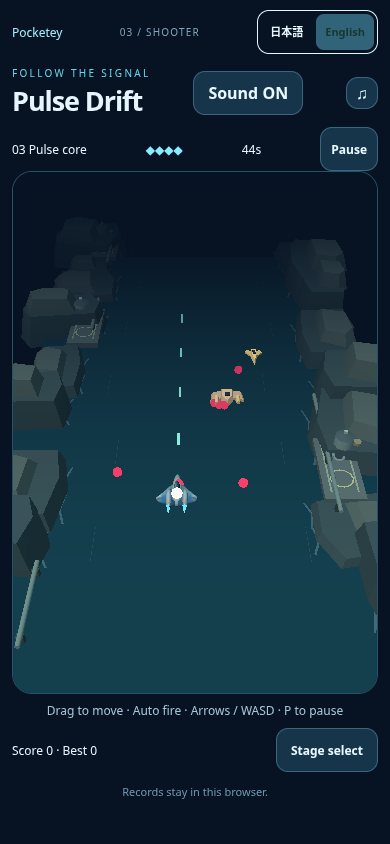
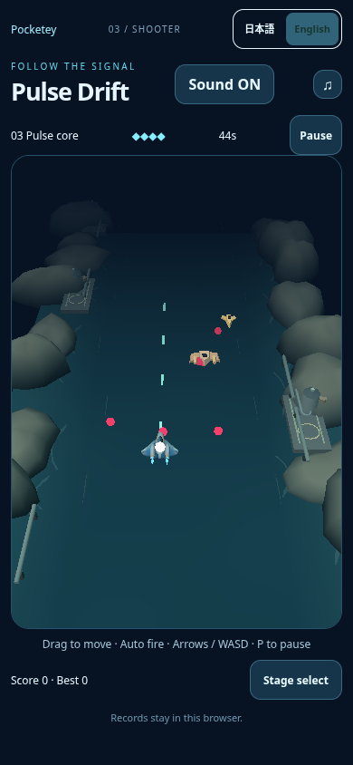

# Pulse coast final visual trial

Follow-up to surface candidate `b656175d96801c4337d43c15c30c7632f567cbb1` in draft PR19. This is the final bounded full-scene direction trial for user judgment. No merge, publication, long CI or performance approval.

## Normal smartphone comparison first

|Previous painted aircraft + angular coast|Final coast/water trial|
|---|---|
|||

Actual local game captures at390×844/DPR1, unchanged normal game camera. Stage3, native touchStart/move18CSSpx left/release120ms, soundON, unpaused play. No model/state writes, DOM/camera override, suppressed effects or image editing. Baseline4.167→4.650s during screenshot, candidate4.117→4.117s; both4HP/errors[]. These are separate native episodes, not exact synchronized actor states. JSON retains actual actors, input, capture time and counters. Background changes are visible across the frame; fine aircraft surface details remain small. Pink bullets, cyan shots and white player collision marker remain visually distinct in the inspected candidate capture. This is image inspection, not a hardware/player-feel guarantee.

## One background system changed

Three deterministic reusable erosion profiles replace the old stacked polygonal hulls. Each has rounded shoulders, irregular outline, wider undercut wet toe and uneven small crown, with smooth vertex normals. Vertex paint fades from cool dark wet rock through muted grey-green sides into a lighter sediment-colored upper surface. Six/five/five instances retain the sixteen existing bank locations and scrolling rhythm, with existing width/height/depth variation and wider yaw variation. No additional landmark objects. Existing platforms, facilities and pipes are unchanged.

The water uses a flat subdivided plane with static vertex colors: darker open channel, subtly lighter shallow banks, very low-amplitude broad color variation. Sparse existing current marks are tapered instead of rectangular; existing broken shoreline wash is curved and its opacity reduced from.48 to.25. No animated shader, texture fetch, reflection, PBR, postprocessing, light, shadow, transparent full-water overlay or external art. All coast geometry/colors are authored in the existing TypeScript view; no new asset fetch. This intentionally remains quiet behind the game actors rather than aiming for photorealistic water. The current geometry does not make exact shoreline foam conform to every eroded outline.

Aircraft paint/Blender source/GLB fromb656 retained exactly. Camera, player size, collision/model/input/difficulty/audio/save and other games unchanged. Lighting remains the previous two lights. The renderer and game loop are unchanged.

## Bounded validation and cost

`npm run check:games`, `ASTRO_TELEMETRY_DISABLED=1 npm run build` (including portal route/redirect generation check), and `git diff --check` passed. The first build command failed before building because Astro telemetry tried to create an unavailable home config directory; disabling optional telemetry allowed the normal local build. No filesystem/security exception.

Normal native screenshots both showplay witherrors[]. Candidate short smoke checks GLBready, ordinary keyboard motion, pause clock freeze, bounded resume, retry, stage-menu/relaunch and no pageerrors; adjacent `evidence/smoke.json` stores its actual final state. This does not substitute for full regression or long CI.

Three coast instance batches replace one: **two additional background draw calls**. Each rock has61vertices/108triangles, compared with36triangles for the old joined cliff, so sixteen instances add1152submitted triangles. Water changes12→384triangles; shore8→9per instance; ripple2→4per instance. Nominal geometry delta is1564triangles before culling. Actual near4s record:baseline14calls/3888triangles vs candidate16calls/5464triangles; actor timing and projectile counts differ, so the raw total delta is not an exact geometry-only measurement. All three rock batches share the existing terrain Lambert material; water now also reuses it. No added shader/material/texture/light/shadow cost. Smooth contours do add vertices/triangles and two draws, so performance is **unapproved**, not claimed unchanged. No new FPS/device benchmark or longCI was run. Prior rounded-model software-renderer variability and mobile performance concern remain unresolved.

Baseline localHTTP4381 (detachedb656 worktree), candidate4382; no HTTPS/certificate/proxy/refusal workaround. Capture uses existing `scripts/capture-pulse-interceptor.mjs` with explicit baseURL/output variables. Library helper authentication401 remains unresolved, so new evidence is saved in the repository/local ZIP, not reported as Library-uploaded. PR stays draft for parent/user judgment; no further incremental polish is planned without a new decision.
