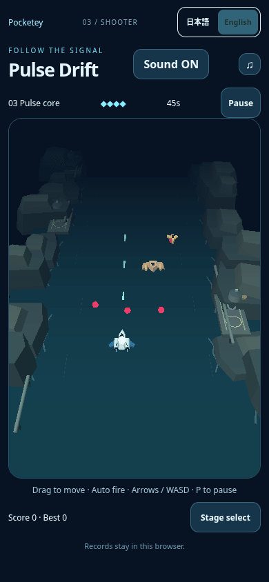

# Pulse: collision core during damage

Draft follow-up to published main `8714b3f7724df370326a45a615ca98e21f5607da`. Parent explicitly authorized this bounded quality fix. No merge or publication until parent's integration order.

The existing invulnerability blink hides the entire interceptor and its white collision marker. The marker is already an independent scene object, but `draw` copied the hull's visibility onto it. Remove that assignment: the core retains its default visible state and continues following the player's unchanged x/y every draw. Existing radius `.18`, height `.45`, white material, depth handling and render order remain unchanged. Hull/exhaust blinking and hit-background flash remain. This also keeps the core visible during the existing initial grace period.

Only production change: `src/games/prototypes/shooter/view.ts`. Model, app, controls, collision, 1.35s invulnerability, 1.3s warning, four shields, enemies/HP, stage durations, camera, audio, settings and saves are byte-identical to base. No other game's code changes.

## Short actual scenes

| Published behavior | Draft behavior |
| --- | --- |
|  |  |

GIFs contain chronological real browser PNG frames, with CDP timestamps converted to GIF timing and palette quantization. No artwork synthesis, interpolation, crop, effects suppression, pause or game-state/DOM/camera writes. They are separate ordinary-input episodes, not exactly synchronized simulation frames. Sound ON in the page; GIFs have no audio. Direct listening is not claimed.

The mobile native touch moves18CSSpx left near launch and releases after120ms; the player stays still during the focused capture so the pixel ROI cannot drift due to approximate diagnostic/frame synchronization.390x844/DPR1, Chromium/SwiftShader. Baseline observes3.850–6.233s, candidate3.817–6.117s; both naturally go4→3HP. Viewed before hull-off frame012 and candidate hull-off014/hull-on017: before loses the whole position marker, candidate displays the white core while hull disappears and returns. Representative full-frame PNGs are adjacent.

## Focused regression checks

`tests/prototypes/damage-core.mjs` uses native browser inputs and asynchronous screencast; promptly acknowledges frames and writes/decodes them without blocking the input sequence. Sharp is already present in the locked build dependencies; no new dependency. Each raw PNG is checked for white pixels near the stable projected core and blue hull pixels away from it. Requires natural damage, remaining in play, no page errors and both hull blink phases. Candidate requires white core pixels in every frame; baseline mode requires the regression to occur. Diagnostics are nearest previous observations, not exact render-state timestamps.

| Case | Frames | Hull-off frames | Minimum core white pixels | HP / errors |
| --- | ---: | ---: | ---: | --- |
| Published mobile baseline |48|17|0|4→3 / none|
| Draft mobile touch |50|14|104|4→3 / none|
| Draft desktop keyboard |26|7|117|4→3 / none|

An initial desktop capture ended just as its first hit was observed6.350s, before a hull-off frame: its **capture-coverage assertion failed**, not the core visibility check. The final harness now includes at least1.4s after an observed natural hit, with a30s wall-time bound, instead of relying only on a6.1s stop. The completed desktop observation covers3.983–6.250s, first observed hit4.483s (native timed-key duration can span different frame counts). Both initial and completed records are retained in `focus-results.json`; the initial desktop record is labeled invalid for blink review. No runtime/difficulty adjustment was made between captures. Valid mobile episodes already covered the full post-hit window; they are retained without another replay. Full raw frames/diagnostics also remain at `/workspace/asset-intake/pulse-damage-core/` in the writer workspace.

Commands against built previews:

```sh
PULSE_CORE_BASE_URL=http://localhost:4336 PULSE_CORE_EVIDENCE=test-results/core-before node tests/prototypes/damage-core.mjs --baseline
PULSE_CORE_BASE_URL=http://localhost:4335 PULSE_CORE_EVIDENCE=test-results/core-touch node tests/prototypes/damage-core.mjs
PULSE_CORE_BASE_URL=http://localhost:4335 PULSE_CORE_EVIDENCE=test-results/core-keyboard node tests/prototypes/damage-core.mjs --desktop
npm run check:games
npx tsx --test tests/prototypes/shooter-model.test.ts
ASTRO_TELEMETRY_DISABLED=1 npm run build
git diff --check
```

Typecheck, existing nine model tests (damage grace/collision/beam warning/boss/deadline/save) and build/portal guard pass. Build initially hit the local Astro telemetry config-path error; using the repository's existing `ASTRO_TELEMETRY_DISABLED=1` convention resolves it, with no system configuration change. No long CI or new performance benchmark was started for this two-line renderer diff and focused draft. Focused captures are visibility evidence, not FPS/device/human-feel guarantees.

## Difficulty evidence

Existing stationary runs naturally take damage; cautious native-input runs clear, and prior boss-aim observation has playerHP4/boss5of32 at35.267s with12.733s remaining. Earlier moving capture's damage preceded beam firing, away from enemy bodies; projectile contact was plausible but no exact offending projectile/collision traced. These records do not establish an invisible attack, blocked escape route, unfair collision or impossible deadline. No broader difficulty adjustment is proposed from bot scores. Warning1.3s, shields4, enemy/bossHP and all durations remain unchanged. A later concrete reproduction would be needed to propose another adjustment.

Published8714's unrelated Tilt desktop performance gate43.97fps/p95 50ms remains recorded in PR11; this draft neither addresses it nor claims all four-game gates green. Prior mobile41.96fps sample, physical iPhone/performance and direct-listening limitations remain. No new feature, stage, asset, payment or public deployment.
