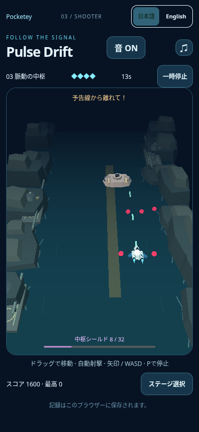
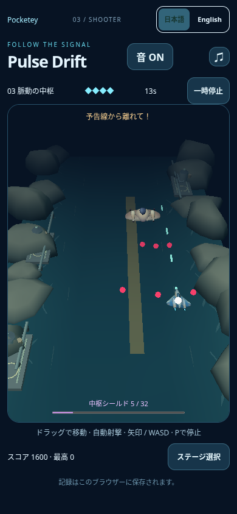
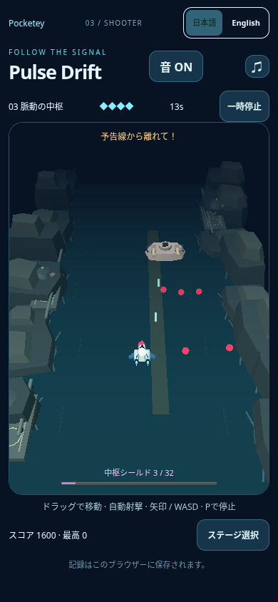
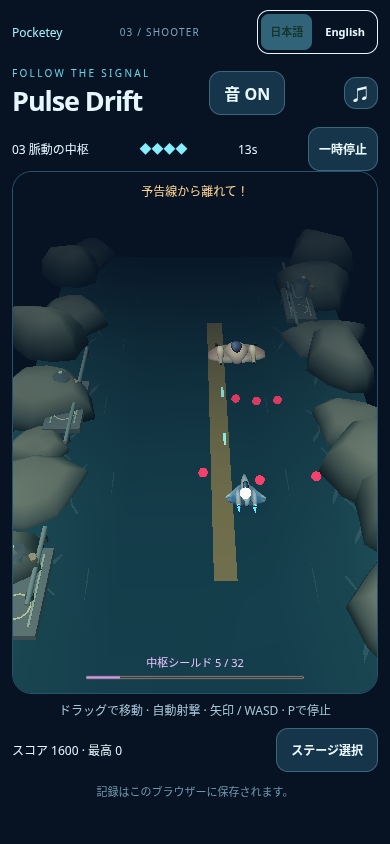

# Pulse final two-profile release candidate

Final limited optimization after parent review ofd106077. Two existing eroded profiles (seeds1and3) replace three cliff batches,8instances each. Profiles alternate by bank row/side; all16bank placements, scale/yaw variations and scroll rhythm remain. This removes **one background draw**. Geometry/paint for the retained profiles, water, aircraft/Blender/GLB, enemies, core, warning, camera, lighting, collision, difficulty, controls, save and audio are unchanged. No more aesthetic work or iterative optimization is proposed in this candidate.

## Every alternating sample

|Order / variant|Whole-play FPS / p95|Boss FPS / p95|Whole-play peak draws /triangles|Boss peak draws /triangles|
|---|---:|---:|---:|---:|
|1 Published main|44.61 /33.4ms|46.01 /33.4ms|14 /3128|14 /3128|
|2 Final candidate|39.91 /50ms|40.13 /50ms|15 /5752|15 /5752|
|3 Published main|41.31 /50ms|47.31 /33.4ms|15 /3116|14 /3116|
|4 Final candidate|47.94 /33.4ms|46.16 /33.4ms|15 /5752|15 /5752|

Each variant has two samples, sequential **published→candidate→published→candidate**, not runs repeated until matching FPS. Arithmetic sample means:whole-play42.96public vs43.92candidate (+2.24%); boss46.66public vs43.14candidate (−7.54%). The first candidate boss sample is materially lower with worsep95; the second is close to public. Do not hide this difference or treat either the earlier single-sample8%gap or these two-sample means as a stable/device regression rate. No statistical confidence, exactFPS equality or performance approval is claimed. Candidate observed peak5752triangles/15draws in both episodes and subsequent native-clear check;6000triangle limit remains unchanged. This verifies the sampled encounters, not every conceivable projectile state.

## Actual boss/warning comparison

|Pair|Published main|Final candidate|
|---|---|---|
|First|||
|Second|||

Inspected real screenshots at390×844/DPR1 and unchanged normal camera. Rounded coast direction remains, and aircraft, boss, white core, pink bullets and amber warning are visible. Native cautious steering, no model/state/camera writes, pause, effects suppression or image editing. Actor positions, counts and boss health differ between episodes. RawJSON preserves all observed frame samples and full before/after/final states.

## Same conditions and measurement boundaries

Current fetched main9538edc3ff8e7c72362e4baab5b0f8331a2c49e8 is the baseline. Prior public module/systemTLS hash match is recorded in [public-runtime-match.json](../pulse-coast-budget/public-runtime-match.json); main remained9538after fresh fetch. Identical isolated local Chromium/SwiftShader browser sessions,390×844/DPR1, framebuffer364×521, Stage3/JA/soundON, same cautious native touch driver and WebGL draw-count/RAF observer. No simultaneous game, other test or build during these four measurements. PublicHTTP4401 and candidate4402; no HTTPS/certificate/proxy exception. No strict-browserHTTPS validation claim.

Whole-play performance excludes startup (state1.5≤time<35.4); boss performance state30.2≤time<35.4 withboss present/play. Whole-play peak draws/triangles include retrieved traces from launch through post-screenshot collection, rather than only the FPS window. Screenshot latency is outside performance windows. Diagnostic state updates every6game renderframes, so boundary labeling is approximate; actual WebGL submitted draw/triangle counts are observed everyRAF. `scripts/measure-pulse-coast-boss.mjs` now records whole-play statistics, framebuffer/renderer and warning-text frames as well as all rawframe samples. Observer overhead is identical and included. Read-only instrumentation does not change gameplay state. Rawframes and exact final view SHA256 are in `alternating-summary.json`/adjacent captures. Shape-instance mapping and unchanged source/art hashes are in `source-check.json`.

## Required functional checks on this final view

- Game TypeScript check, build with portal route/redirect generation verification, JS syntax and whitespace checks passed.
- Existing UI check exercised320×568,390×844,844×390,1280×900:JA/ENlayout, native keyboard movement/release/depth, native touch/depth/cancel, pause/resume, locale duringpause, blur pause, rapidretry, sound setting save; plus corrupt/blocked storage, failedWebGLstartup and contextloss. All8cases passed/errors[]. Only temporary local baseURL/evidence-path adapters used; repository test assertions were not changed.
- ForcedGLBrequest abort versus normal load both reportedfallback/ready respectively. Native launch/play/pause/retry/reload continued, sound setting persisted, errors[]. No network refusal workaround; this is deliberate local failure injection.
- Existing damage-core visual check passed with41unpaused real frames after natural damage4→3→2HP.14hull-offframes, minimum104whitecorepixels in **every** frame; existing hull on/off assertions retained. Actual [hull-off frame](evidence/core/frame-009.png) was inspected. No damage/invulnerability/state injection or core threshold change.
- Existing native play/save driver scoped toStage3touch only, kept winning/noerror checks and assertedStage3best>0 rather than requiring unrun stages. Won at38.067s with4HP/2600score. Whole savedobject `{best:[0,0,2600],mute:false}` matched after normal reload. Evidence:`play-report.json`, `touch-stage3-result.png`. This is one focused clear/save check, not all three stages or both input modes cleared anew. Keyboard/touch controls are covered by the UI checks above.
- All four functional check groups exit0 (`checks.json`). Warning text was observed in every performance sample (68/60/70/65frames); beam geometry was also submitted/visible. Warning/core/enemy rendering and model source unchanged. No functional issue was observed in these bounded checks.

No thresholds loosened, no fullCI run initiated, no merge or publication. No physicaldevice/human-feel/listening guarantee. These final bounded results are ready for parent's decision about **one** exact-candidate fullCI, rather than more optimization repeats. Library helper401 remains unresolved; all evidence is in repository/local reviewZIP, not claimed Library-uploaded.
