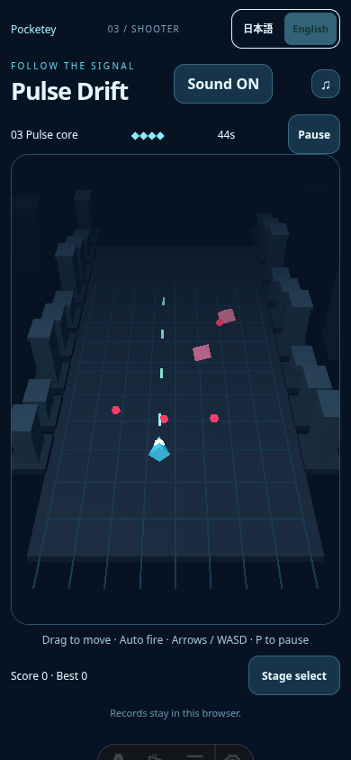
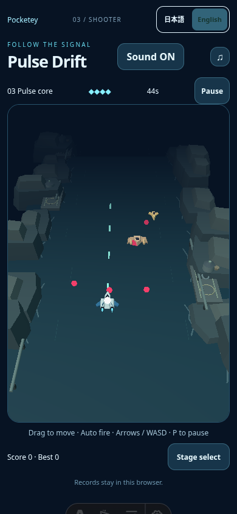
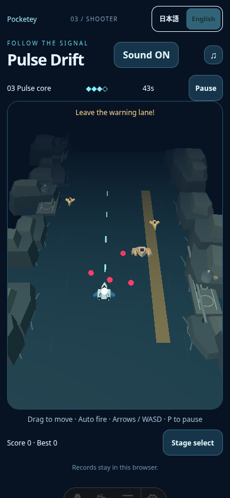
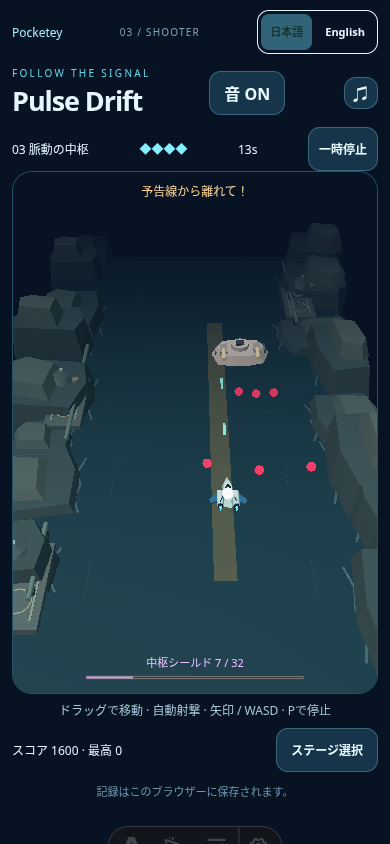

# Pulse Drift: first silhouette and location review

Base public main: `a443ec37c33cae22021c82b7b20f3fb6e62f02c6`. This is an unmerged first visual candidate, not a finished release. Only Pulse production rendering changes.

The independent original interceptor has one pointed nose, swept blue wings, dark canopy and paired engines with cyan exhaust. Existing enemy roles gain narrow scout, broad fan fighter and armoured twin-barrel boss silhouettes. All are authored colored low-poly meshes in code, with one combined geometry per hull. No borrowed artwork, new asset/dependency or postprocessing.

The location is a coastal industrial canyon: subdued water channel, stepped rock banks, serviced landing platforms, rounded generators and pipes. The combat centre stays quiet; taller structures sit at the sides. Repeated props are instanced. Existing model, controls, hit detection, difficulty, stages, camera, audio, saves and other three games are unchanged. Existing brief damage flash/blinking remains. Parent approved the revision2 visuals; no additional art polish is planned.

## Ordinary mobile play comparison

390×844, DPR1, actual route and controls, stage3, sound ON, native touchStart/move18CSSpx left/end after120ms. No state writes, DOM/camera overrides, pause or effects suppression. Capture times differ slightly (~4.02–4.13s baseline and4.10–4.37s revised candidate); these are ordinary play comparisons, not pixel-aligned identical simulation frames. Health is not forced: the revised capture starts with HP4 and its post-capture observation has HP3. Adjacent JSON records states/render counters and no page errors.

| Published baseline | First candidate |
| --- | --- |
|  |  |

Additional warning and boss captures retain actual amber lane/red projectiles and native warning text. All are unpaused normal native play; the existing invulnerability blink is not suppressed.

Harness: `scripts/capture-pulse-interceptor.mjs before|after`, run against the corresponding checkout using `PULSE_ART_BASE_URL`, `PULSE_ART_SHA`, optional `PULSE_ART_EVIDENCE`. It uses the existing local Chromium/SwiftShader. TypeScript game check and diff whitespace check passed. Long exact-SHA CI has deliberately not been started before art review; this branch is outside the existing automatic push branch list.

## Requested official references: blocked

On2026-10-08 the existing normal HTTPS proxy rejected all four supplied Konami URLs with `Tunnel connection failed: 403 Forbidden`. Web viewing also rejected the TwinBee redirects to img.konami.com; the Gradius image opens returned no viewable image content. The images were not actually viewed. No restriction bypass or source image copying was attempted. This candidate therefore follows the parent's written coastal canyon/interceptor direction rather than claiming a verified visual study of the supplied images.

- Town: https://www.konami.com/products_master/jp_publish/dl_detanatwinbee_arcade_c/jp/ja/images/ss01.png
- Canyon: https://www.konami.com/products_master/jp_publish/dl_detanatwinbee_arcade_c/jp/ja/images/ss03.png
- GradiusII: https://www.konami.com/games/gradius/s/img/en/gradius2_01.jpg
- GradiusIII: https://www.konami.com/games/gradius/s/img/en/gradius3_01.jpg

Revision2 visual review is approved. Performance regression blocked publication; see PERFORMANCE.md for the one bounded intervention, measurements and next-scope proposal. Public main is unchanged.

## Revision2 after parent review

- Restore the white collision marker from y.73 to the baseline y.45; depthTest/depthWrite disabled and renderOrder10 keep it visible over the new hull without shifting its projection. Its radius and all physics remain unchanged.
- Enemy hull and wings now share a lighter ochre/beige paint. Enemy fog is disabled to preserve distant scout readability; pink projectiles retain their existing color/material. Polygon winding is normalized before extrusion, including mirrored wings, so side normals face outward.
- Uneven rock width/height/depth/rotation and offset shore phases replace synchronized rows. Three staggered serviced pads and five pipe sections leave gaps. A wider water surface and broken muted waterline strokes mark the rock/water contact; the centre remains quiet. Repeated geometry remains instanced.

Boss capture uses ordinary native touch steering from stage3 launch to35.25s; it captures before35.25/after35.38s, HP4, live boss and warning age.25→.38. No state writes, pause, camera edits or damage suppression. `scripts/capture-pulse-interceptor-boss.mjs` preserves the existing bounded native-input test controller solely to reach the scene. No clear/save assertions were claimed by this art capture.

Revised ordinary/warning/boss captures have no page errors and respectively22/18/21 draw calls with3644/3068/3660 triangles in their recorded scenes. These are scene counters, not an FPS pass or worst-case budget guarantee. `npm run check:games` and `git diff --check` pass. Long CI and merge remain pending independent visual review.
