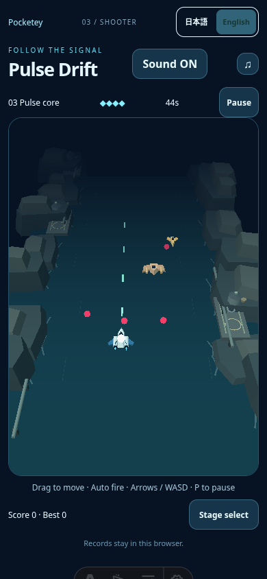

# Approved low-detail flattening and corrected sampling

Starting code:935c272f51a0d072aae95e5ca5d8e5f2cba7432f. Public baseline:a443ec37c33cae22021c82b7b20f3fb6e62f02c6. Parent authorized only flattening foam extrusion, painted landing rings and ripple boxes; no changes to vehicles/enemies/marker/hazards/asymmetric banks/camera/resolution/physics/difficulty/save/audio or other games.

| Repeated detail | Before triangles | After triangles |
| --- | ---: | ---: |
|16waterline strokes|576|128|
|3serviced platforms incl painted rings|396|180|
|12ripple strokes|144|24|
|Total reduction| |784|

The thin foam outline now uses an upward-facing triangulated polygon; the painted rings retain inner/outer radii. Flat upward-facing ripple quads preserve width/length/color. Reviewed vehicles, enemy silhouettes, banks and their materials/positions are unchanged from935c272. Typecheck/build/whitespace checks pass. Actual unpaused native mobile play screenshot shows no page errors, ship, enemies, pink bullets and recognizable waterway.

## Measurement limitation discovered and corrected

The historical comparisons measured240RAF frames after1.5s. On slower rendering this extends the simulation farther, changes the entity/beam workload and can sample result mode. This is not a fully equal game-time comparison. In the initial flat-code round, one desktop sample reached the normal idle player's HP0/result; its20.51fps cannot be averaged as ordinary-play performance. Keep the full record rather than remove it:performance/performance-flat.json. The240frame round had mobilebaseline46.31/44.52 versus candidate35.75/29.43fps and desktopbaseline28.63/35.66 versus candidate38.23 plus invalid20.51fps. These results exposed the method limitation; they are not asserted as a valid desktop average or a proven code-level regression.

Only the measurement harness was corrected, without another runtime optimization. `scripts/compare-pulse-rendering.mjs` now measures a fixed5second RAF window after1.5s, retaining balanced baseline/candidate/candidate/baseline order and unchanged native stage2 launch/default mute. It records elapsed/sampleCount and retains allPlaying/errors checks. No retries or assertion/quality threshold relaxation. Actual elapsed5016–5033ms; windows cover approximately simulation1.5–6.7s. Framebuffer baseline/candidate remains578×556desktop,364×521mobile. No in-play screenshot/state/camera edits. This corrective measurement was performed once because the preceding measurement included a result-state sample.

| Device | Baseline fps | Flat candidate fps | Baseline p95ms | Flat candidate p95ms |
| --- | --- | --- | --- | --- |
|Desktop|36.04 /26.14|37.34 /37.90|50 /66.7|50 /50|
|Mobile|52.74 /51.73|56.71 /41.96|33.4 /33.4|33.2 /50|

Full authoritative fixed-duration data:performance/performance-flat-timed.json. All8samples remain playing with errors[]. Desktop candidate samples exceed both baseline samples; the earlier large desktop degradation is not reproduced in this corrected window. Mobilecandidate mean49.34 vs baseline52.23(~5.5% lower), with substantial candidate variation and onep95 50ms. Do not claim universally unchanged performance, hardware-device FPS, or all45fps gates pass. The earlier~20%/~13% claims described the historical frame-count protocol and require this method qualification; they are not a conclusive exact percentage of code-level slowdown.

Fixed-duration peaks:baseline desktop18/18draws and1560/1560triangles versus candidate14/15draws and2556/2592triangles. The flat change reduces geometry by784 at an otherwise identical simulation scene; different recorded temporal peaks need not subtract exactly784. Mobile counts are in JSON. No second runtime batch beyond the authorized flat details, no resolution cut and no difficulty change.

## Verification and integration

The flat candidate is frozen for one exact-commit regression CI. Reviewed1805CI37735995384 is terminalfailure dueAmber44.36fps and knownTilt41.64fps/p95 50; its Pulse six native clears/save/UI/retry and audio97cases succeed. Those are historical checks, not the new candidate's CI. A new exact-commit run will verify the flat code.

Other three games are now being developed independently; this branch edits only Pulse production rendering and associated evidence/harness. Parent controls integration order. No merge or Pages publication is performed by this stage. Public main staysa443ec37 until parent integrates approved work. Real-device performance remains unverified.

If fixed-candidate CI exposes functional issues or important Pulse deterioration, report before more changes. Minimal further option would be a short real-route trace separating GPU draw/main-thread/compositor latency under this fixed-time protocol, rather than another geometry/material search. No additional geometry cuts are currently proposed or implemented.
