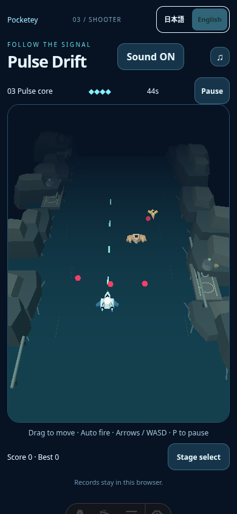
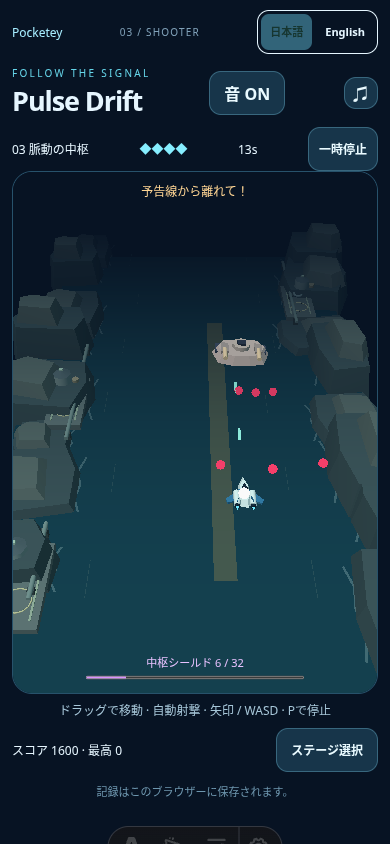

# Pulse performance: one bounded optimization, publication still blocked

Visual approval:1805f01d785ef6636afa4bbbe2b49f26853510e1. Public baseline:a443ec37c33cae22021c82b7b20f3fb6e62f02c6. On2026-10-08 a single material/projectile batching optimization was applied and measured. It does not satisfy desktop no-regression; no new CI, merge or publication is authorized by this result.

## Diagnosis, before changing runtime

Isolated production-renderer/model fixed4s scene,578×556 framebuffer,160RAF draws per condition with30warmup. Temporary test-only scene visibility/material ablations; they do not certify gameplay. Query EXT_disjoint_timer_query_webgl2 with ready/non-disjoint results and separate JS submission timing. Full object geometry/material inventory and measurements:performance/render-diagnosis.json. The first attempt's harness exposed no renderer because three.js assigns render on the instance; it failed before any measurement. The corrected harness uses an isolated source copy exposing scene/renderer for diagnostics. No production mutation for diagnosis.

| Isolated condition | Draws | GPU median ms | GPU p95 ms | JS median ms | RAF fps |
| --- | ---: | ---: | ---: | ---: | ---: |
| Full reviewed scene |19|20.48|45.90|0.80|32.94|
| Water hidden |18|20.47|40.38|0.90|28.88|
| Cliffs hidden |18|19.00|32.14|0.70|35.51|
| Shore strokes hidden |18|17.37|35.90|0.40|37.04|
| Lambert material ablation |19|10.05|21.75|0.30|57.76|

This identifies significant material cost in the isolated scene. It does not completely explain end-to-end desktop frame latency; the later normal-route measurement remains worse despite the intervention. No claim that deleting water or geometry alone resolves the regression.

## One runtime intervention

- Replace Standard physical surfaces with Lambert diffuse surfaces, keeping fixed lights, source colors, fog settings, geometry, camera and sizes. Facet shading remains.
- Batch existing red sphere bullets and cyan box shots into one InstancedMesh draw each. Matrices retain original x,.45,-y/identity rotation and scale. Pools grow by powers of2 instead of truncating bodies; initial count0, frustum culling disabled to avoid stale empty bounds; old instance buffers are disposed on growth and all final resources on teardown.
- Preserve geometry of the interceptor/enemies/banks/waterline/platforms/pipes, white marker position/radius/depth overlay, hazard colors/opacity, physics, difficulty, stages, save, audio and framebuffer. No changes to other games.

Typecheck/build/diff checks pass. Actual route ordinary mobile and boss+warning captures contain no page errors. They preserve visible aircraft, pale enemies, bright red projectiles, amber lane and asymmetrical waterway. No pause/state/camera edits or damage suppression.

## End-to-end same-condition comparison

Native stage2 launch, default mute, same local Chromium SwiftShader,240RAF intervals after1.5s; baseline/candidate/candidate/baseline per viewport. Baseline/candidate framebuffer sizes identical:desktop578×556,mobile364×521. All observed simulation states remain playing, no page errors. P95 and FPS include actual route/UI/model/render behavior. No retries. Compare full recorded samples rather than one favorable result; hardware-device FPS remains unverified.

| Round/device | Baseline fps (2samples) | Candidate fps (2samples) | Baseline p95ms | Candidate p95ms |
| --- | --- | --- | --- | --- |
| Reviewed1805 desktop |36.13 /35.57|27.11 /29.94|50 /50|66.7 /50.1|
| One intervention desktop |31.01 /35.03|25.32 /32.17|66.6 /50|100 /66.7|
| Reviewed1805 mobile |34.76 /56.10|45.10 /47.59|66.7 /33.3|33.4 /33.4|
| One intervention mobile |23.92 /45.85|52.67 /57.74|100 /50|33.3 /16.8|

Desktop means after intervention:baseline33.02fps,candidate28.75fps (~13% worse in this round). Candidate mean is nearly unchanged from reviewed28.52fps despite isolated material improvement. Mobile improves, with substantial baseline variation; do not infer a reliable improvement percentage from its cold/noisy sample. Desktop maxima23draws/1820triangles baseline versus17draws/3908triangles intervention (reviewed maximum26draws). Publication condition is not met. No second tuning batch or new full CI was started.

Full data:performance/performance-compare.json,performance/performance-optimized.json. Both use native-route code; `scripts/compare-pulse-rendering.mjs` reproduces the protocol with PULSE_BASELINE_URL/PULSE_CANDIDATE_URL/PULSE_CANDIDATE_SHA/PULSE_PERFORMANCE_EVIDENCE. Existing45fps/p95 gates remain unchanged. The candidate data labels working-tree source before the documentation commit; the new commit identifies the tested source. No runtime edit after these captures.

## Prioritized next proposal; not implemented

1. Preserve the approved interceptor, enemy role outlines, white marker, pink bullets and warning exactly. They are the user's main readability improvement.
2. Preserve the quiet water and asymmetric rock outlines. Reduce non-silhouette geometry: the16shore strokes currently576triangles; an identical flat strip would use128. Painted landing rings account for288of396platform triangles; flat12segment rings would reduce platforms to180. Ripple boxes144 could become24flat-quad triangles. These three changes target784unnecessary thin/painted triangles without replacing banks with boxes or reducing resolution.
3. Only if necessary, trim hidden generator/pipe bottom caps and arc segments (facilities564,pipes280triangles). These are secondary detail. Do not add new effects, lights or infrastructure.

The diagnosis does not yet isolate all desktop cost. These are narrowly scoped proposals, not claimed solutions or promised FPS. Seek parent's next scope decision before another runtime intervention or test round.

## Reviewed1805 CI terminal

https://github.com/shou773/pocketey-portal/actions/runs/37735995384

- portal and cross-browser jobs success.
- quality19pass/1failure:Amber desktop44.360393fps<45; native stage/save/fallback checks complete. Baseline ordinary controls passed4cases; thresholds unchanged.
- audio41Chromium+56WebKit/Firefox pass.
- Tilt5pass/1failure:desktop41.635032fps<45 andp95 50>40. All6native clears/save and other functional checks complete. Known unchanged-game software FPS issue; no Tilt optimization.
- Pulse all6touch/keyboard clears/save, UI8, idle failure/retry/stage select and performance script success. Touch HP4/4/4, keyboardHP4/2/3, keyboard boss win44.38s. Overall new-games job failure dueTilt; aggregateaudio=success,cross=success,tilt=failure,pulse=success. Overall CI failure, not green.

This CI validates reviewed1805, not the subsequent material/instancing code. New code has typecheck/build/capture and paired performance evidence, but lacks its own full functional CI because it is not a publication candidate yet. Public main remainsa443ec37.
