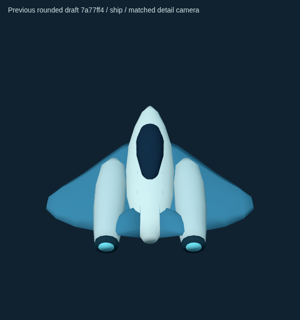
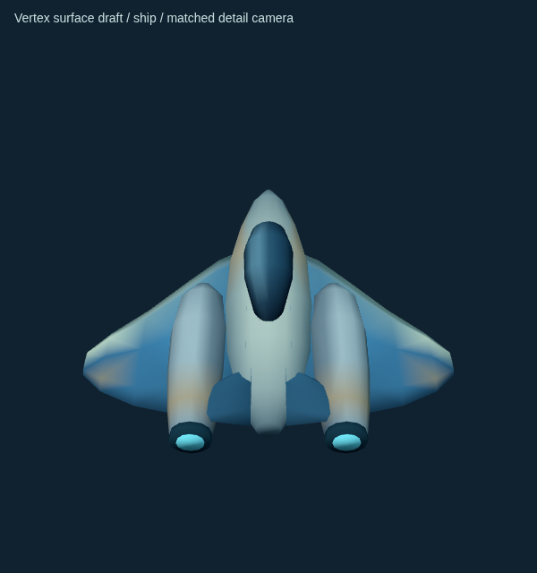
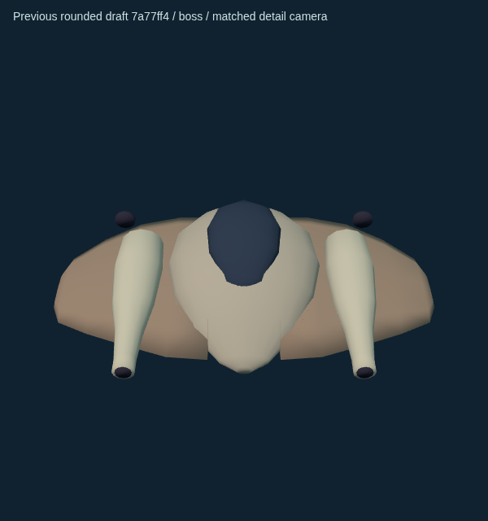
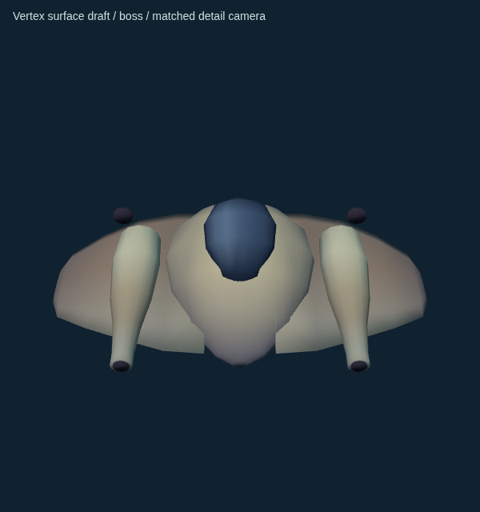
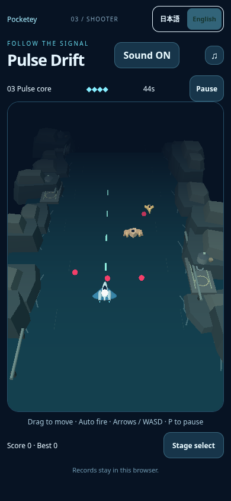
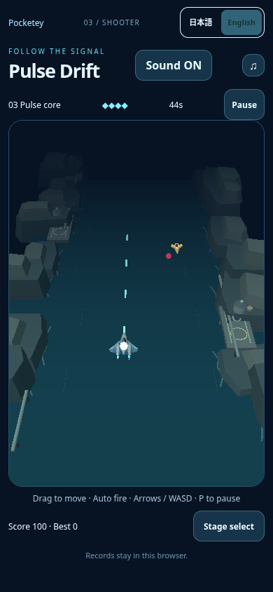
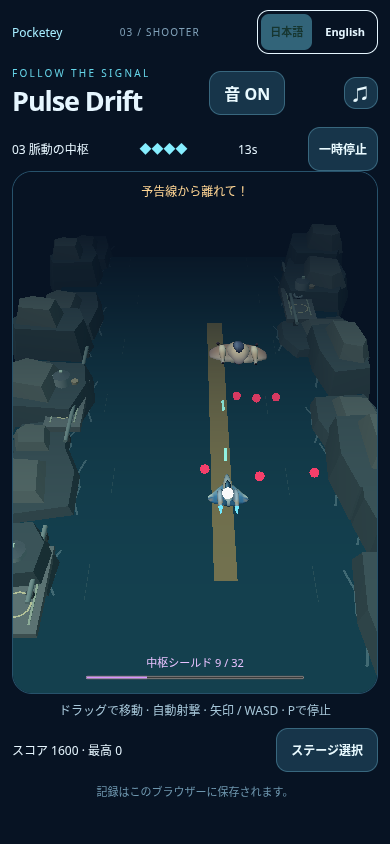
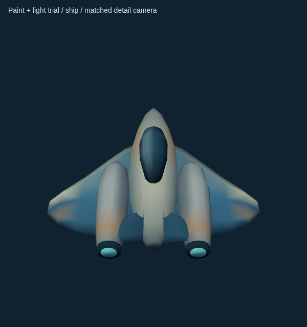
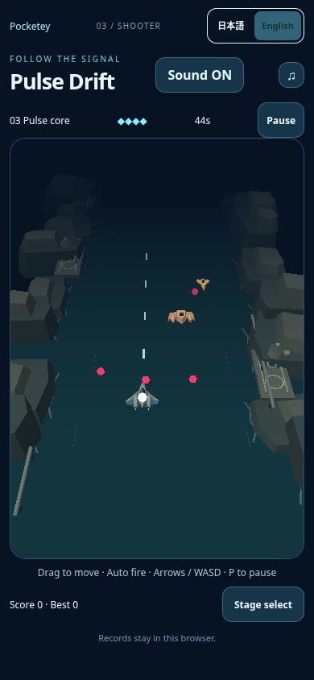

# Pulse surface-design trial

Follow-up inside draftPR19 to rounded-model candidate7a77ff43ccae53fef7fbeee20d9052ea4956fbdc. User approved rounded shape direction but requested more designed surfaces, shading/gradients/color and a lighting comparison. **Visual direction draft only**:no longCI, merge or publication. This does not claim the game's entire visual-quality request is finished.

## Kept shape, designed vertex paint

Ivory upper fuselage blends into cool blue-grey underside; recessed wing/engine joints are shaded. Azure wings have a bright ivory leading rim and darker trailing edge/root. Engine shells have cooler shaded undersides, dark nozzle recesses and a small warm metal band. Dark canopy has a narrow baked sky-reflection gradient that distinguishes it visually from opaque exterior paint. Boss uses warmer ochre metal over cooler violet-grey underside and a broad dark dorsal window with a restrained reflection. Cyan is confined to existing nozzle mouths and exhaust; no decorative emission added. Gradients and shading are authored corner/vertex colors in Blender, not real-time AO or reflective/PBR glass. The painted reflection is static; it does not track the camera/light as a physical reflection.

No geometry redesign. Exact exported POSITION/NORMAL/INDEX buffer hashes match previous7a77 for both meshes (geometry-check.json). Triangles1168player/1192boss, same vertices and normalized normals, two joined meshes, one shared vertex-color material, no textures. GLB remains60220B. Existing runtime Lambert shader and two light sources unchanged; no extra material/draw/light, shadow or postprocessing. No model/app/control/physics/difficulty/camera/audio/save/other-game changes. Existing white core, hit blink, cyan shots, pink bullets and amber warning rendering unchanged.

## Matched close-view comparison

|Object|Previous rounded draft7a77|Surface paint / current light|
|---|---|---|
|Player|||
|Boss|||

Exact same model transforms, game light colors/intensities and paired detail-gallery camera per object600x640/DPR1. As in prior gallery, cameraFOV35, location(0,d,d*15/14),target(0,.12,0),d2.1player/3.3boss. This is explicitly a **close-view gallery**, not a zoomed/altered gameplay camera. All images are real local Three renders, not synthesized/edited comparisons. Gallery labels identify previous rounded draft, which was not public. Script/helper temporary paths `/tmp/pulse-flow-gallery/gallery.js`, `/tmp/capture-pulse-surface-gallery.mjs`; localHTTP4370.

## Same-camera normal smartphone views

|Scene|Previous rounded draft7a77|Surface paint / current light|
|---|---|---|
|Native Stage3 near4s|||
|Native boss near35s|||

390x844/DPR1, unchanged actual game camera, native touch and soundON, no pause/model/state/DOM/camera override or suppressed effect. Near4s pairs use18CSSpx left then release120ms; boss pairs use prior bounded native cautious steering solely to reach boss+warning. Episodes are not exactly synchronized actor states:near4s before4.067 vs after4.117→4.350duringcapture; entities/projectiles/score can differ. AdjacentJSON stores all actual states and errors[]. PlayerHP4 before/after near4s. Do not attribute framecounter differences to paint:before14calls/3660tris vs after13/3304 have different active enemies/projectiles. Each vehicle itself retains one draw and exact geometry. Normal-camera details remain small/subtle compared with close view; the unchanged angular rocks still dominate much of the scene. Background/world redesign is not part of this surface trial and no overall completion claim is made.

## Lighting test and decision

Same final paint/model tested with two existing lights only:

|Setting|Current / kept|Temporary neutral lighting|
|---|---|---|
|Hemisphere sky/ground/intensity|#b5edff/#16253b/2|#e4edf8/#1b2530/1.35|
|Key color/intensity|#ffffff/2|#fff4dd/1.65|
|Key position|(-4,10,4)|(-3,8,2)|

Neutral trial reduces cyan cast but darkens small player and water/cliffs. A clear normal-camera improvement was not demonstrated, so **lighting change is not adopted**. Trial is isolated in detached local `/workspace/pulse-surface-light7a77`, not part of branch production code. Player/boss close-view trial PNGs and normal mobileJSON retained; camera/model/paint payload equal to final variant. Normal episode has14calls/3660triangles/errors[], with actual actors differing slightly. No costlier light/shadow/PBR/postprocess experiment was added.

## Scope/validation/cost limits

Final candidate modifies Blender authoring paint and reexports .blend/GLB only, plus review evidence. POSITION/NORMAL/INDEX byte equality is the focused shape/normal verification; exported color/byte size and local build successful, runtimeGLBready observed, whitespacecheck passes. No fresh long model/whole-game/CI or FPS retuning for a color-only diff. Previous PR19 load/fallback/core checks and nine model tests are prior-candidate evidence, not newly rerun here. No prior performance problem is considered resolved:plain rounded-model trial had variable software-renderer FPS and mobile mean~5.5%lower. Same mesh/material/shader cost is structurally retained, but exact new FPS/device performance is unmeasured. Rendering/input screenshots are visual evidence, not human-feel, direct-listening or hardware guarantees.

Local paths are confirmed baseline4371,paint4372,lighting4373; no HTTPS/certificate exception/proxy or access refusal bypass. Previous Library helper auth401 remains unresolved; no retry/workaround. Images, source and records are in the draft repository/local workspace for parent's comparison-page update. User feedback on this surface direction comes before another scope/CI/integration/publication decision.
