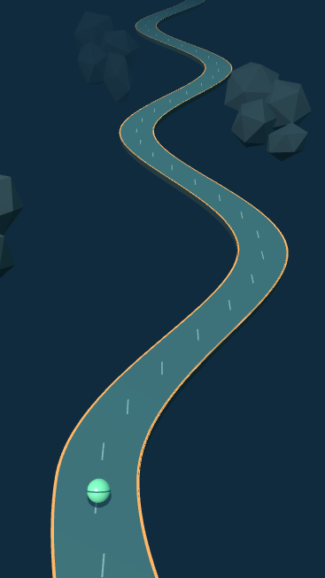
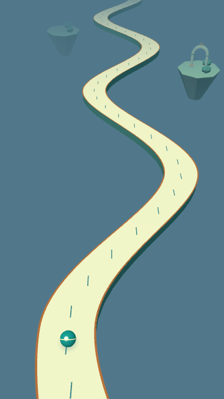
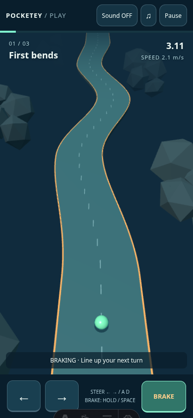
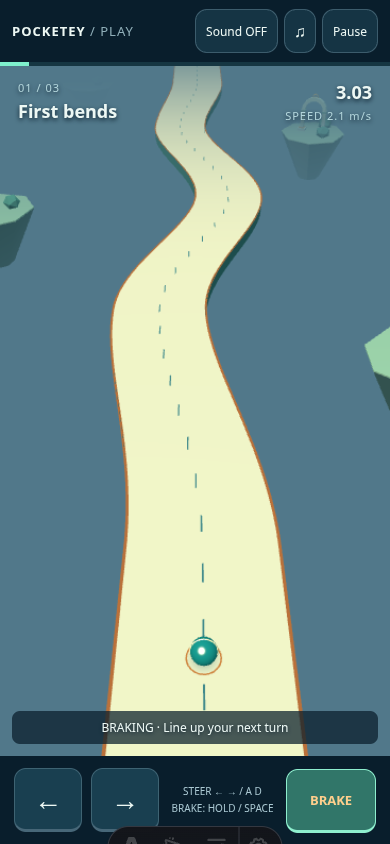
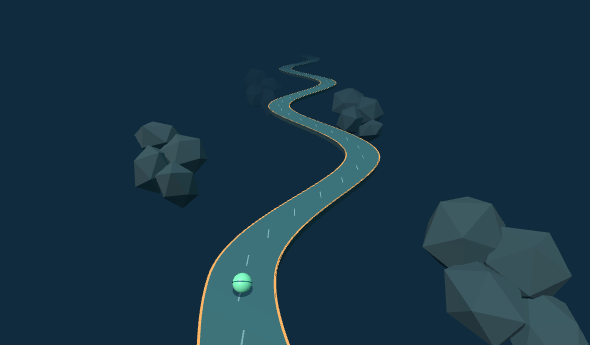
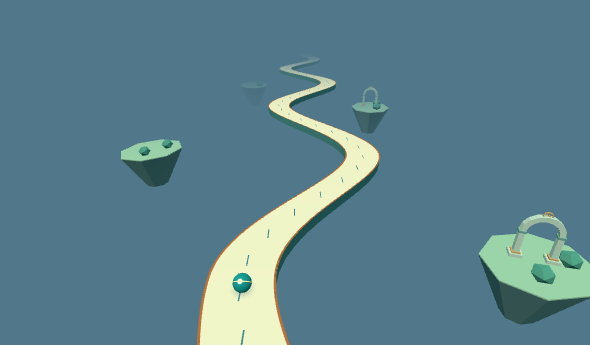
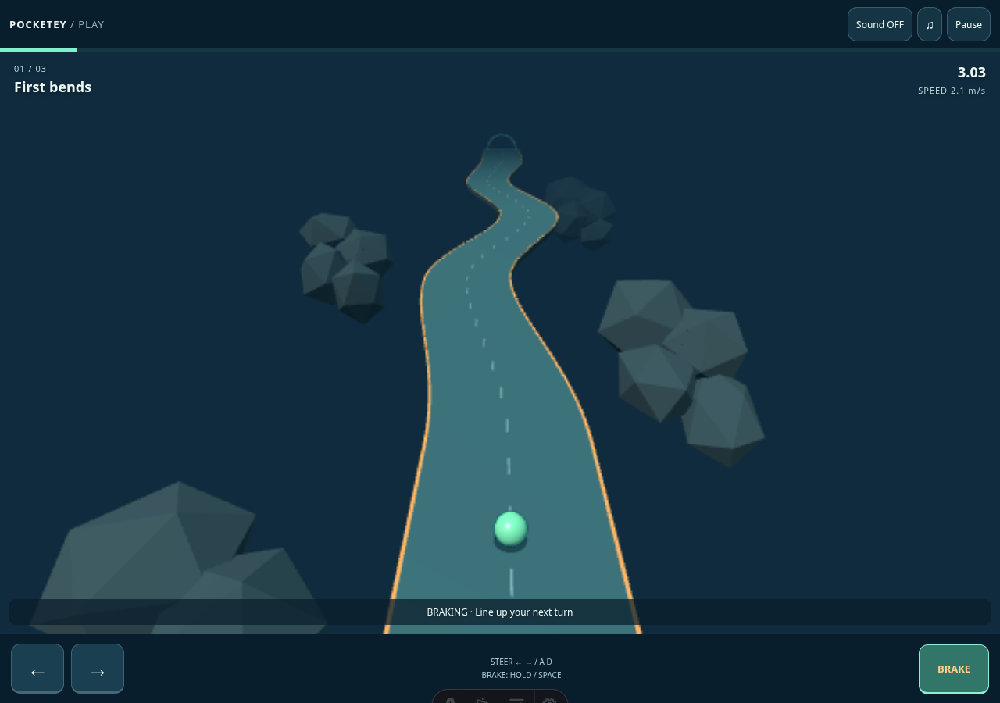
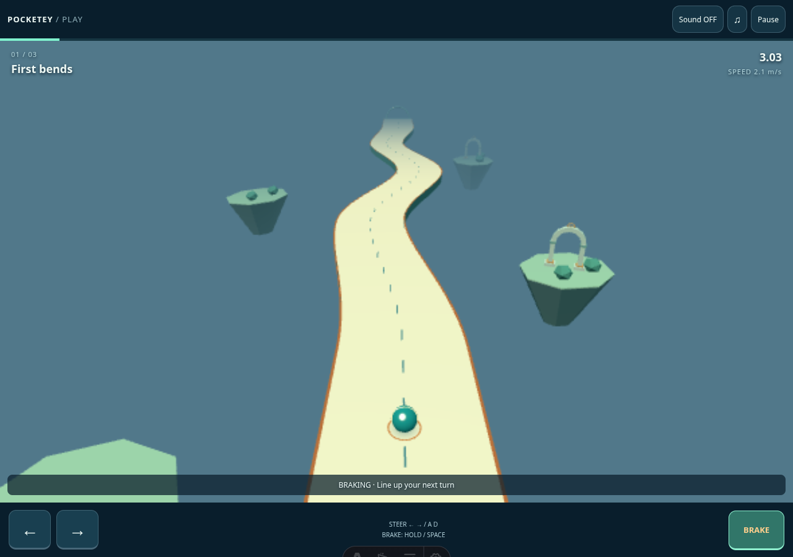

# TiltTrail ceramic garden review candidate

Base: published `a443ec37c33cae22021c82b7b20f3fb6e62f02c6`. Branch: `art/tilttrail-sculpted-landscape`. Image review comes before full CI; this candidate is not merged or deployed.

The independent art direction is a floating ceramic garden and observatory. The official reference is [Super Monkey Ball Banana Rumble](https://www.bananarumble.com/index.html), specifically its toy-like course thickness, distinct playable surfaces, readable ball highlights and pale distant architecture. The parent inspected [adv-ss2](https://www.bananarumble.com/media/img/gameplay/adv-ss2.jpg) and [adv-ss3](https://www.bananarumble.com/media/img/gameplay/adv-ss3.jpg). This worker could read the official page and open adv-ss3, but the web tool could not access adv-ss2; that failure was not bypassed. No reference image, monkey, banana, character or course asset is included in the repository or game.

The cream ceramic top follows exactly the existing road vertices and support width. Teal sides extend downward by 0.68 instead of 0.42 units; bronze-colored open edges remain flat, with no rail or implied collision. The teal opaque ball has a cream rolling band and a small specular highlight. A 32×32 procedural radial contact decal replaces the hard circle; a small amber ground ring appears only when the existing brake control reports held during play. That read is cached from the existing control DOM and changes no input or game state.

Six garden islands replace the old 24-rock clusters. Their components share one vertex-colored, instanced Lambert mesh; three hollow observatory frames share another. Island tops are below y=-6 and outside the ribbon, leaving the fall space clearly open. The two identical bronze edge ribbons are batched into one draw without changing any vertices. Reused low-resolution geometry replaces higher-resolution ball and finish geometry. No lights, shadow maps, postprocessing, external reference assets, reflection/refraction or dependencies are added. The existing two lights, camera, projection, antialias setting and framebuffer budgets remain.

Blender 4.3.2 was already installed. `create-observatory.py` authors an original ceramic frame with footings, bronze plinths/collars and a small astronomical sighting ring. Its actual game asset is `public/games/tilttrail/models/observatory.glb`: 22,292 bytes, one mesh, one primitive, one material and 236 triangles. It has vertex colors and no textures, animations, compression or runtime decoder dependency. The runtime reuses its geometry three times with one Lambert draw; no real-time reflections are involved. `procedural-arches-mobile/desktop.png` retain the prior procedural alternative. The Blender frame adds readable feet and celestial detail, most visible on the nearest desktop island. Its mobile benefit is subtle; it is not presented as a major character-quality upgrade.

The small GLB loads asynchronously and never blocks play. Existing procedural arches remain the fallback if loading fails. The renderer switches geometry without resetting the ball, camera, physics or course; loaded and in-flight resources are disposed on teardown. Export Blender's source with `blender --background --factory-startup --python docs/release/tilttrail-art/create-observatory.py`. Blender reported unavailable Draco support, but compression is disabled and the ordinary GLB export succeeded; no decoder was installed.

## Matched images

| 390×844 touch viewport | Before | Candidate |
| --- | --- | --- |
| Same stage-3 physical state at t=6 |  |  |
| Native stage-1 ordinary held brake |  |  |

| 1280×900 fine-pointer viewport | Before | Candidate |
| --- | --- | --- |
| Same stage-3 physical state at t=6 |  |  |
| Native stage-1 ordinary held brake |  |  |

The matched canvas pair uses unchanged production model steering/braking steps and production renderer functions, with identical complete states, camera calculations, CSS dimensions and framebuffers. It is an isolated renderer comparison, not a native end-to-end input capture. Mobile CSS 390×694, framebuffer 367×653; desktop CSS 1280×750, framebuffer 590×345. `before.json` and `after.json` retain the full states and render counters. The candidate diagnostic awaits the real GLB load; the native game continues normally during loading. State, size and framebuffer equality was asserted. Mobile calls 9→9, triangles 5028→5482; desktop calls 11→11, triangles 5680→5782.

The separate native captures use actual Play and held brake input (CDP touch on mobile, mouse on desktop), with no model/DOM state write, no pause overlay and zero page errors. Screenshot simulation times are bracketed in JSON and vary slightly. The native stage-1 candidate includes the brake ring: 12 calls / 4654 triangles, versus baseline 11 / 4504. Compare the deterministic pair for exact positions rather than inferring exact native timing equality. The native browser captures were not direct public-site captures: they run this checkout of the specified published SHA and the local candidate. The web tool could not access the public game URL.

## Short ordinary-play observation

`play-sequence.mjs` captures six successive mobile frames from one native stage-1 play: held touch brake, continuing brake, a brief native ArrowLeft turn while braking, brake release and acceleration, deliberate ArrowRight off-road fall, and failure. Full before/after diagnostics are retained in `play-sequence.json`; there are no state writes, timing bypasses, pause-for-screenshot, immunity or game modifications. I inspected those actual rendered frames. No video was replayed and no physical phone or human control-feel test was performed.

The first curve is visible well before the ball reaches z=10 and before the brief steering pulse. The cream surface, teal thickness and bronze open edge stay distinct as the camera moves. The cream band changes orientation between braking frames, while the highlight and shadow keep the ball legible. The braking ring disappears after release; the released frame is captured 300 ms later, with the control reporting false and speed rising, so this observation bounds its disappearance to that interval rather than claiming a measured human reaction time. The contact shadow and ring are absent in the falling frame. Islands and frames remain beyond/below the road, never filling the drop as a playable surface. The forced fall is expected from deliberately holding right off the road; it is not evidence of an unfair failure.

These few scenes cover continued braking, a short braked turn, and release/no-brake acceleration. They do not cover a complete brake-free course, all stage-2/3 narrowings, human difficulty or a full native clear. The full stage-3 matched image shows the upcoming narrowing and bends but is static evidence. The [Marble Trap creator page](https://nannings.itch.io/marble-trap) is the additional visibility/balance reference provided by the parent. TiltTrail keeps its existing generous braking option and has no added punitive timer or hazards; balance changes remain a separate task.

Two initial sequence attempts using a second CDP right-touch failed to observe a fall within the capture timeout; this is an unresolved capture/input-driver observation, not assigned to gameplay or the renderer. The final sequence uses native touch braking plus native keyboard steering and explicitly records that input mix. The unchanged full touch suite is still required after visual approval. One initial dev capture also hit Vite's stale optimized-module 504 during the new loader import; restarting the local server resolved it. Final matched/native captures have zero page errors.

## Verification and limitations

TiltTrail model tests: 6/6 pass. Games TypeScript check passes. Astro check: 0 errors, 0 warnings, six pre-existing hints. Production build and portal retirement guard pass (existing Three.js chunk-size warning remains). `git diff --check` passes. The runtime change is limited to this game's renderer and original asset; model, app, UI, audio, saves, stages, dependencies and CI are unchanged. The approved brake test synchronization is described below.

`render-benchmark.mjs` alternates the published-SHA renderer and candidate on the same Chromium/SwiftShader environment, at the same t=6 state and framebuffer, with one active page and renderer. Three rounds retain every interval, FPS and p95 in `render-benchmark.json`. This is an isolated rendering diagnostic, not a substitute for the normal-input performance CI or physical-device measurement. Earlier versions and every sample remain in `render-benchmark-preliminary.json`, `render-benchmark-procedural.json` and `render-benchmark-glb-unbatched-edges.json`. Preliminary round 0 overlapped initial static-check work. The island components were combined into one reusable mesh, and the two identical road-edge draws were then batched. The final measurement runs separately with the loaded Blender asset.

| Final diagnostic, median of three rounds | Published SHA | Candidate |
| --- | --- | --- |
| Mobile FPS | 60.00 | 60.00 |
| Mobile p95 frame interval | 16.7 ms | 16.8 ms |
| Desktop FPS | 60.00 | 59.02 |
| Desktop p95 frame interval | 16.7 ms | 16.8 ms |

The final isolated diagnostic keeps mobile at the frame cap. Desktop has one slower final round (60.00→48.87 FPS, p95 16.7→33.4 ms), with a 1.6% lower candidate median. Every final isolated sample exceeds 45 FPS with p95 below 40 ms, but this fixed-state diagnostic does not prove absence of a regression or replace the unchanged native normal-input gate. Earlier measurements also vary substantially across rounds. Preserve every sample and require the exact-SHA normal-input gates after image approval; no physical-device performance conclusion is claimed.

After visual approval, runtime candidate `6339f1c54f5e743793e162ef15bce407b0ee5c10` passed the existing six native TiltTrail tests and ten Chromium TiltTrail release/audio/input tests. Local Firefox profile startup and WebKit system dependencies remain blocked; exact-SHA full CI remains pending. Existing FPS thresholds are unchanged. SwiftShader results do not establish physical-phone performance, and this candidate is not reported as all-green or ready to publish.

## Approved brake test synchronization

The brake-only assertion now waits for at least 1.4 seconds of the existing HUD's simulation time instead of 1 second of wall time. The unchanged model converges toward 2.15 at rate 3.5: from maximum speed 5.8, reaching below the unchanged 2.2 assertion takes more than 1.226 simulation seconds. The extra margin allows HUD/frame sampling. The wait polls every 50 ms, has a 5-second wall timeout, and fails if active play or the held brake is interrupted. It never writes game state. Initial and final HUD snapshots, both elapsed times, held input and the unchanged limit are saved even if settling fails. Repeat runs retain separate files.

The focused native two-finger/touch-cancel/orientation/page-return test passed three repeats with no retries or skips; [brake-sync-evidence.json](brake-sync-evidence.json) records every run. Observed initial speeds vary with normal input setup and HUD sampling. The earlier CI run `37744832694` did not record its initial speed or simulation interval, so this change does not claim its immediate cause was proven. The separate SwiftShader FPS failure is unresolved; no performance threshold, physics or difficulty was changed.

Reproduce images with Astro dev at port 4332: `node docs/release/tilttrail-art/capture.mjs before|after`. Use `TILT_ART_BASE` to select the source server. For benchmark reproduction, serve detached published SHA at 4333 and candidate at 4332, then run `node docs/release/tilttrail-art/render-benchmark.mjs`.
