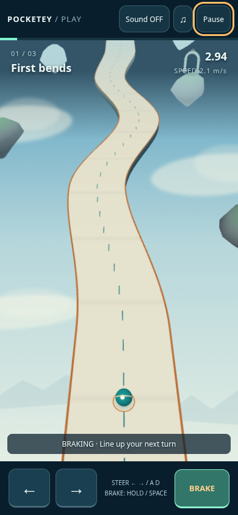
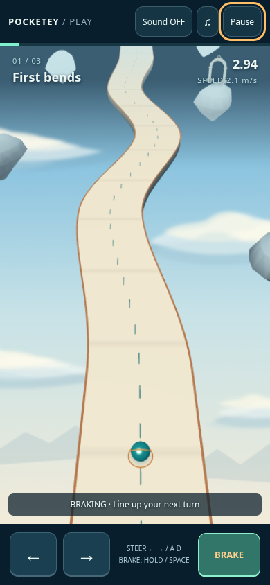
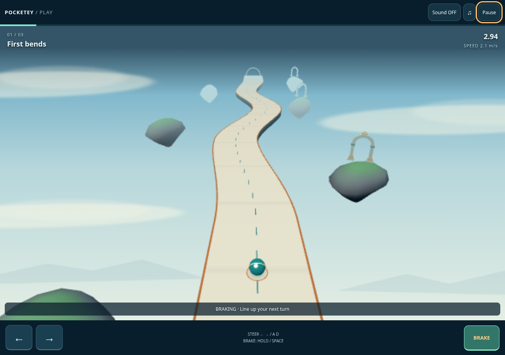
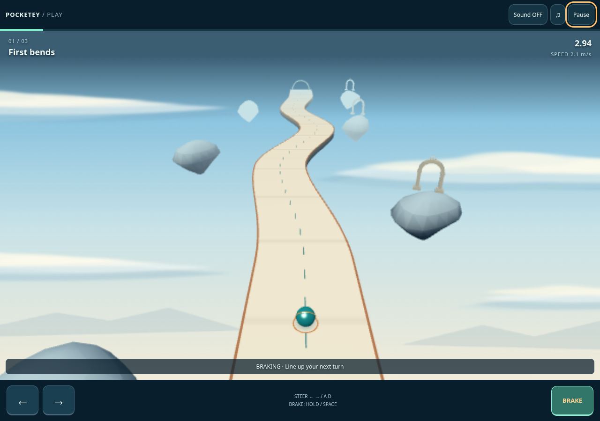

# TiltTrail — luminous ceramic course

Independent visual draft from public main `7adf12ab464cfbb8e9d4e04917ad9f618a1a5f4b`. The only production change is `src/games/prototypes/ball/render.ts`. No reference images were obtained; this implements the parent's written direction. No main merge or publication.

| Actual built game | Before | After |
| --- | --- | --- |
| Mobile 390 × 844 |  |  |
| Desktop 1280 × 900 |  |  |

These are actual WebGL screenshots from the built `/games/tilttrail/` route, with its real UI and app loop. Ordinary launch and Space brake, then Playwright's clock advances 3000 ms and freezes for capture. No state, camera, canvas or DOM replacement. Before/after diagnostics are byte-identical: sampled HUD time 2.9417, z 5.7192, x 0, 13 calls / 4800 triangles. HUD diagnostics lag the final rendered frame by design; the identical clock/input sequence fixes the pair. Screenshot timing is a visual fixture, not a frame-rate measurement. `before.json` / `after.json` retain renderer and framebuffer details; all page-error lists are empty.

Warm ivory ceramic, pale joints and warm upper/cool lower sides clarify the existing road thickness. The copper edge retains its exact mesh and width. The existing teal sphere has a softer specular highlight and subdued gold band; neither sphere nor band geometry changes. The 256 × 512 static sky texture now has a blue-to-warm gradient and three asymmetric, layered clouds. Existing island vertices are repainted pale blue-gray with a broad height ramp. Observatory assets and transforms are unchanged. No additional mesh, material draw, texture size, light, postprocess or per-frame work.

## Validation

- Existing 6 ball model tests, `npm run check:games`, production build/portal guard and `git diff --check` pass.
- Three existing browser tests pass unchanged: ordinary multi-touch clears all three stages and persists best times independently; fall/retry/pause/input/mute/language; touch cancellation/orientation/page return/context loss. See `evidence/functional-report.json` and `mobile-functional-completion.json`. All original performance limits remain enforced.
- `geometry-check.mjs` compares **every scene mesh's positions, indices, normals, world transform and instance matrix**, camera and model state in all three stages against public main. All hashes and draw counts match. No track, collision, input, UI, save, audio, other game or asset file was changed.
- Forced rock/observatory/both loading failures remain playing without page errors (`fallback-check.json`). Existing fallback rocks receive the same palette.

## Drawing load

The auxiliary fixed-scene benchmark uses the actual renderer and model at stage 3 / t = 3 s / brake visible. It is explicitly a renderer diagnostic, **not native gameplay footage**. One active page at a time, three alternating rounds per viewport, 200 RAF intervals per row with 20 warmup intervals omitted, same Chromium SwiftShader and same framebuffer. Raw intervals are in `render-benchmark.json`.

| Median of three rounds | Before | After |
| --- | ---: | ---: |
| Mobile FPS / p95 ms | 59.67 / 16.8 | 60.00 / 16.8 |
| Desktop FPS / p95 ms | 55.67 / 33.3 | 59.02 / 16.8 |
| Mobile calls / triangles | 11 / 5676 | 11 / 5676 |
| Desktop calls / triangles | 13 / 5976 | 13 / 5976 |

Desktop timings vary between runs; the apparent speedup is not a hardware performance claim. Geometry, draw load and framebuffer are identical, and the native functional test also retains the 45 FPS / p95 40 ms / 16 calls / strictly below 6000 triangles limits. The initial shared-node_modules development comparison failed to adopt the baseline observatory because of duplicate Three module identity; those files are explicitly `invalid-shared-dependencies-*` and excluded. Both worktrees now use independent `npm ci` installs from the unchanged lockfile. Native before screenshots were always made from a correct production build.

Reproduce with baseline dev 4383, candidate dev 4382 and candidate production preview 4381. Run `capture.mjs before|after` against the corresponding built version (`ART_BASE` override), `geometry-check.mjs`, `render-benchmark.mjs`, `fallback-check.mjs`, then `NEW_GAME_EVIDENCE=docs/release/tilttrail-luminous/evidence npx playwright test --config docs/release/tilttrail-luminous/local.config.ts --grep 'ordinary multi-touch|fall → instant retry|two-finger controls'`. Browser/TLS/OS security settings and dependencies are unchanged.
