# TiltTrail organic scenery review

Base: latest main `9538edc3ff8e7c72362e4baab5b0f8331a2c49e8`. Branch: `art/tilttrail-organic-islands`. This is a new visual-review draft; no merge, publication or long whole-game CI is requested before direction approval.

The previous ceramic palette did not fix the large eight-sided island platforms and separate block-based building feet. Those six silhouettes occupy the sides of normal play more than the already-round ball. This candidate replaces them with exactly two original Blender assets: a domed hanging rock and an asymmetric stone observatory arch rooted into that same rock. The wider shoulder, narrow crown, tapered underside and offset strata replace the flat planting tray. The observatory has unequal shoulders and flared roots; voxel union and budgeted decimation create one connected surface rather than intersecting blocks. This is an original wind-worn landmark, not a copied character, branded building or source-game asset.

Both models have smooth exported normals, quiet vertex-color mineral bands, one mesh/primitive/material, and no textures, animations, compression extension or decoder. The plain rock is 140 triangles / 4,664 bytes; the rooted model is 320 triangles / 8,912 bytes. Each is reused three times through two instanced draws with one shared Lambert material. Original procedural islands remain the load-failure fallback, so missing scenery does not stop play. No extra light, shadow map, postprocess or reflection is added.

The six background anchor positions are unchanged. New rock crowns are convex, not broad flat ledges, and the highest architecture is approximately 2.79 units below road level; bare rock crowns are 4.85 units below it. The model footprint stays well outside the road. Road vertices, support width, open drop, camera and framebuffer budget are unchanged. No model, input, save, difficulty, audio, other game, shared UI, dependency, test or CI file changes.

## Material pass after the first silhouette review

The parent reviewed `bcb4edac` and found that its pale single-color rock and loop still read as clay or a rounded bag. This second pass preserves every triangle position and smooth normal, and changes only authored vertex colors. The garden crown is green (`#649a72`); exposed stone is gray (`#77828b`); the eroded underside grades to dark blue (`#263e50`). Broad low-frequency strata and restrained underside tint distinguish the three regions without a real-time shadow map. The arch is explicitly ceramic: cream faces (`#eee1bd`), cool glazed inner reveal (`#41868b`), and warm foundation coating (`#ad7952`) on its thicker legs. The architectural color seam stays above the rock crown so it does not smear across the garden surface.

The existing runtime lighting, material type and camera are unchanged. There are still two GLBs, one primitive/material each, and 140/320 triangles. This is another design-review candidate, not a declaration that object quality is complete.

| Same close-up camera | First round silhouette | Material pass |
| --- | --- | --- |
| Rooted landmark | 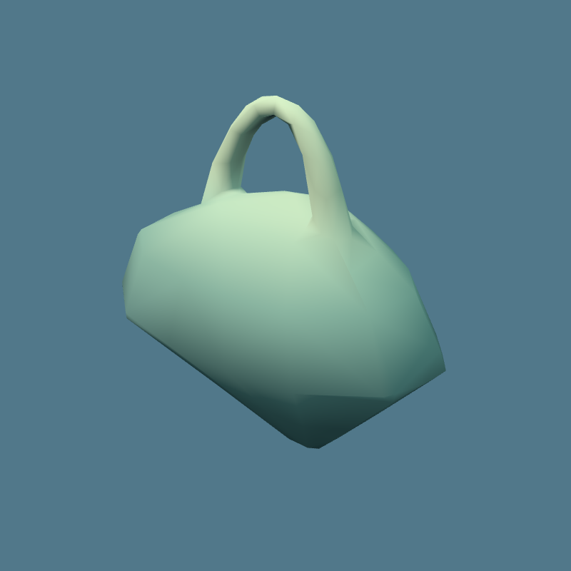 | 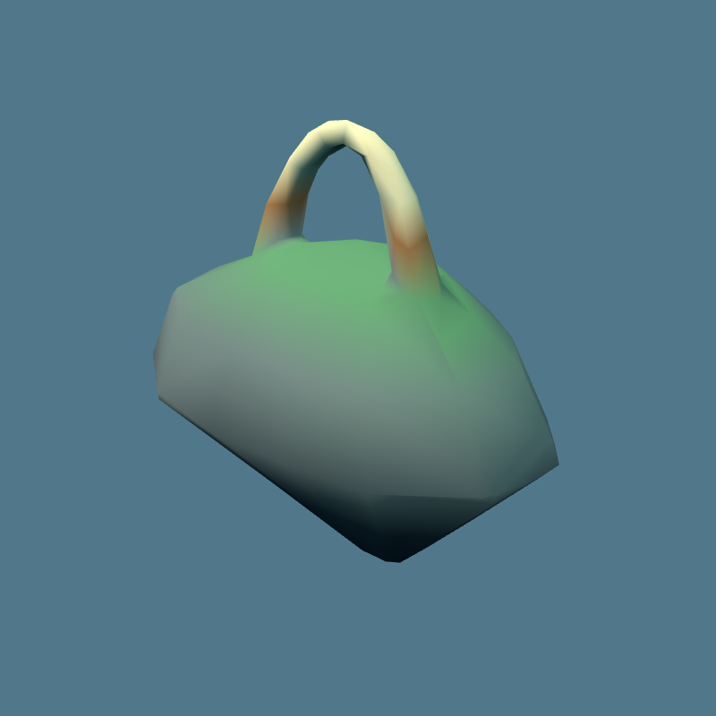 |
| Rock | 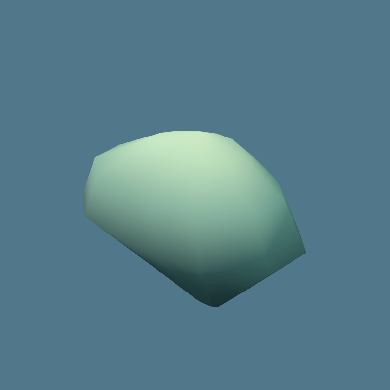 | 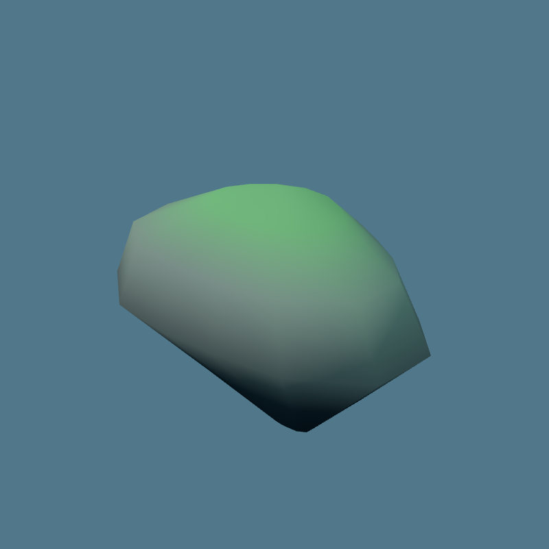 |

| Same game camera/state | First round silhouette | Material pass |
| --- | --- | --- |
| Stage 3 smartphone | 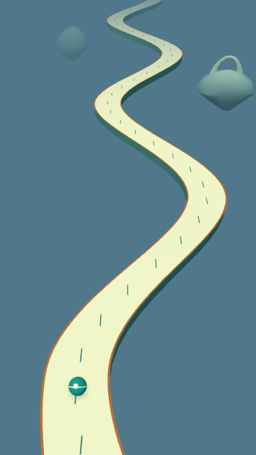 | 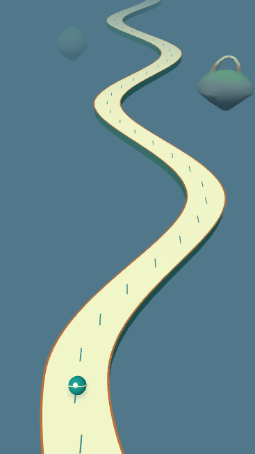 |

Previous v1 images and matched-state records are preserved in `evidence/material-pass/`; the current model previews, game pairs and ordinary-touch frames below use the latest material pass. Native screenshot times remain bracketed rather than claimed identical. All five touch frames remain playing with zero page errors. No long CI, publication, gameplay adjustment or camera change was made for this pass.

## Actual model close-ups

These are the actual game GLBs in a separate evidence viewer with the runtime's hemisphere/sun lighting and Lambert vertex colors. Only the diagnostic camera moves closer; it is never imported by the game.

| Domed hanging rock | Rooted asymmetric arch |
| --- | --- |
|  |  |

[Blender authoring source](create-islands.py) and [actual topology/export report](model-report.json) are included. Both authored meshes have one connected component and zero non-manifold edges; the arch's two roots and rock are one continuous surface. No external source assets are used. Run `blender --background --factory-startup --python docs/release/tilttrail-organic/create-islands.py` to regenerate. Blender reports missing optional Draco support; the ordinary uncompressed export succeeds and no decoder is needed.

## Same-state smartphone comparisons

390×844 touch viewport, canvas CSS 390×694, framebuffer 367×653. Each pair uses the identical full state produced by the unchanged model's normal steering/braking steps, the unchanged production camera, and the loaded production renderer. State, CSS and framebuffer equality were asserted. These isolated comparisons do not claim native input or exactly synchronized end-to-end screenshot times.

| Scene | Main before | Candidate after |
| --- | --- | --- |
| Stage 1, model time 3 seconds | 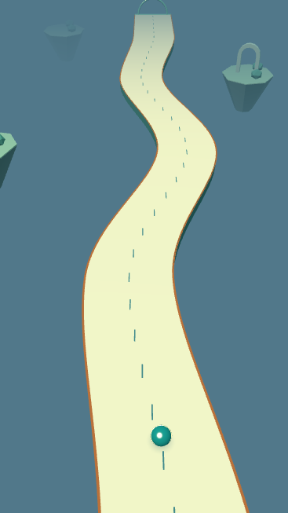 | 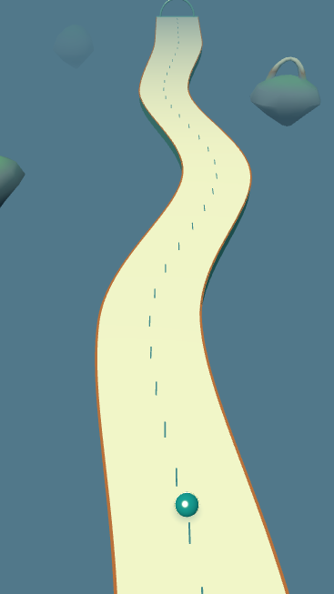 |
| Stage 3, model time 6 seconds |  |  |

Desktop pairs at 1280×900 (canvas CSS 1280×750, framebuffer 590×345) are also retained: [before](evidence/before-stage3-desktop.png) / [after](evidence/after-stage3-desktop.png). The native stage-1 captures include actual held brake, game HUD and controls: [before](evidence/before-native-mobile.png) / [after](evidence/after-native-mobile.png). Their before/after state brackets are recorded in `before.json` and `after.json`; native screenshot positions vary slightly and are not presented as a matched-state pair.

## Short ordinary touch sequence

Five consecutive frames from one ordinary stage-1 play use native CDP touch only: brake, continued rolling, simultaneous left+brake, brake after steering release, then full release/acceleration. No keyboard, state/time write, pause overlay, camera modification or immunity is used. All five frames remain playing, have zero page errors, and retain complete before/after state and held-control evidence in [play-sequence.json](evidence/play-sequence.json).

| Held brake | Short left turn with brake | Released and accelerating |
| --- | --- | --- |
| 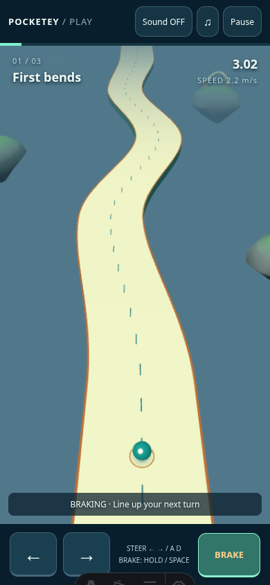 | 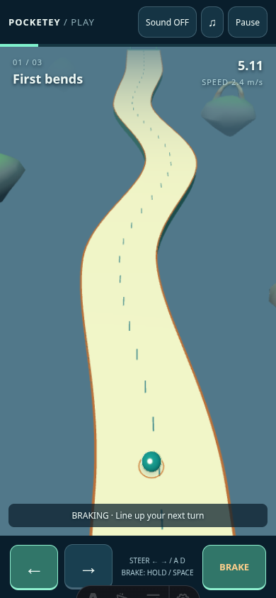 | 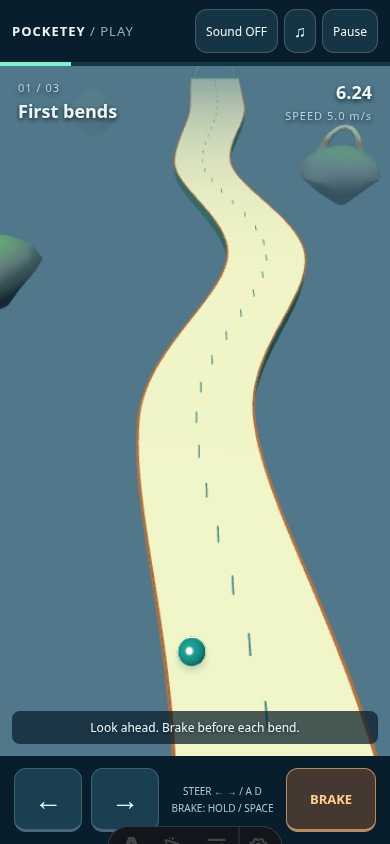 |

I inspected the actual close-ups, matched smartphone views and normal-play frames. The broad background silhouette is rounded and sloped rather than a planter tray; the arch roots meet the rock continuously. The road remains the cream playable ribbon and scenery remains visibly separate from its drop. This is a short local Chromium/SwiftShader visual observation, not a physical-phone, full-stage clear, human feel, or difficulty assessment.

## Drawing budget and review boundary

| Loaded same-state scene | Calls before → after | Triangles before → after |
| --- | --- | --- |
| Stage 1, mobile / desktop | 11 → 11 | 4150 → 4654 |
| Stage 3, mobile | 9 → 9 | 5026 → 5530 |
| Stage 3, desktop | 11 → 11 | 5326 → 5830 |

Native stage-1 held brake reports 12 calls / 4702 triangles; releasing the existing brake ring returns to 11 / 4654. The new background adds 504 triangles over this latest main, not zero. Every captured scene is below the unchanged 6000-triangle and 16-call limits. Future ordinary stage-3 gates remain required after visual approval; these few observations do not bound every possible frame.

The first silhouette candidate `bcb4edac`'s short [rendering diagnostic](evidence/render-benchmark.json) alternates baseline/candidate order over three rounds with one active page/renderer and the same stage-3 t=6 state. Mobile median FPS is 59.6718→59.6698 (median p95 16.8→16.7 ms); desktop 60.0040→60.0020 (p95 16.7→16.7 ms). The lowest candidate sample is 59.3413 FPS. Every sample, including the baseline's 58.3809 FPS round, is retained. This fixed-state SwiftShader check shows no substantial slowdown in this limited sample; it is not ordinary-input performance CI, a no-regression proof, or physical-device evidence. No thresholds were changed. This historical measurement was not repeated for the vertex-color-only material pass below; it is not an exact-head FPS result for that later pass.

Games TypeScript and `git diff --check` pass. Both GLBs were checked as one mesh/primitive/material, with no textures/animations/compression. All final matched/native captures and the touch sequence have zero page errors. Long native all-stage, cross-engine, release/audio and full CI are deferred until the parent shows the comparison and receives direction approval. No merge or public deployment has occurred. Existing independent performance limitations are not waived.

Reproduce with baseline dev at 4343 and candidate dev at 4342. Use `TILT_ART_BASE` for each capture server, then run `capture.mjs before|after`, `capture-stage3.mjs before|after`, `capture-models.mjs`, and `play-sequence.mjs` in this folder. `preview.ts` is the separate close-up viewer only. All images here are local checkout evidence; no denied access or certificate warning was bypassed.
